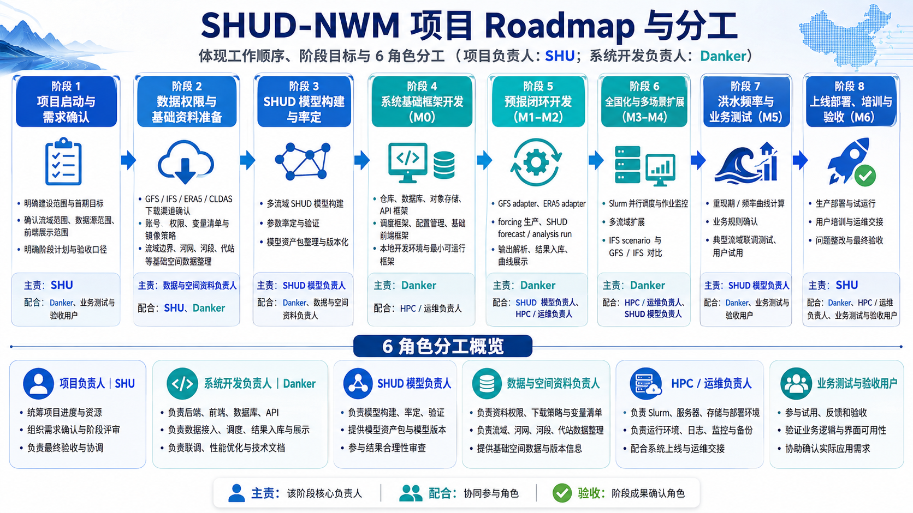
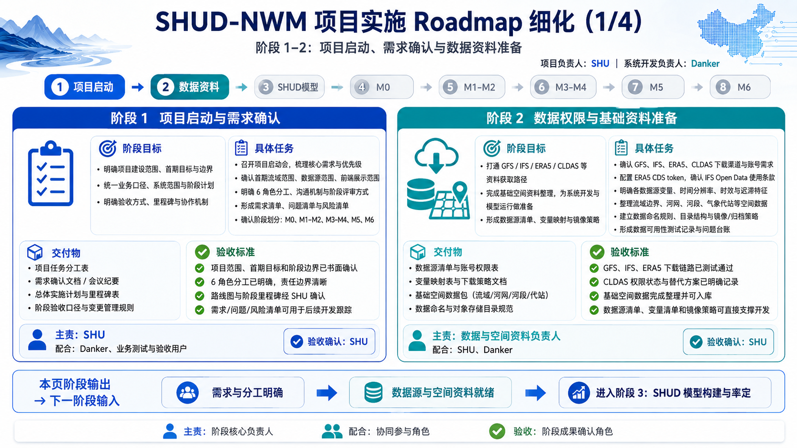
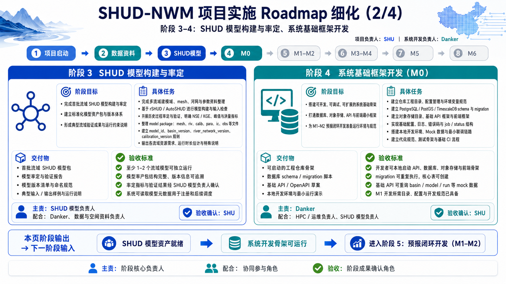
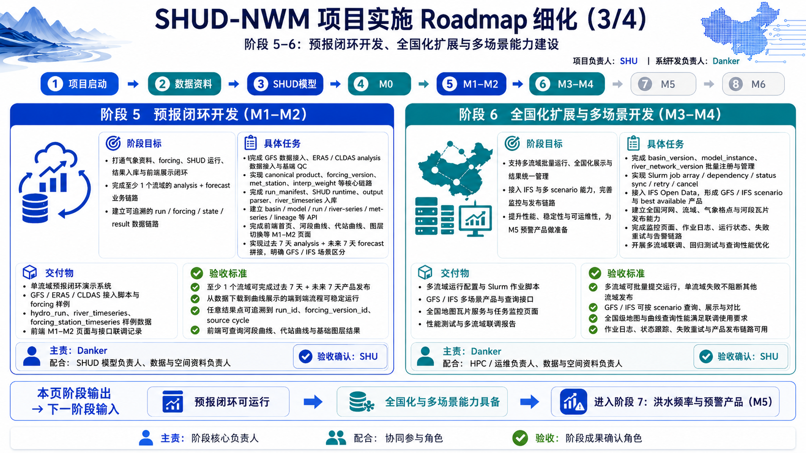
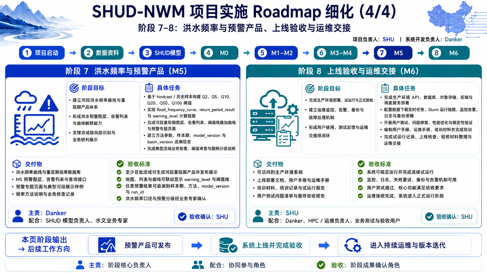

# SHUD-NWM 项目实施路线与分工

> 版本：v1.2 | 更新日期：2026-05-12  
> 项目总负责人：**SHU** | 系统开发负责人：**Danker**



---

## 一、角色分工

| 角色 | 负责人 | 职责 |
|------|--------|------|
| 项目总负责人 | **SHU** | 统筹项目进度与资源；确定需求优先级与验收；推动数据权限获取 |
| 系统开发负责人 | **Danker** | 后端 / 前端 / 数据库 / 接口开发；系统部署与持续集成；协调各角色技术交付 |
| SHUD 模型负责人 | **待定** | 模型资产构建（建模、率定、验证）；模型版本管理与发布 |
| 数据与空间资料负责人 | **待定** | 气象数据源权限申请与下载通道维护；DEM / 河网 / 流域边界等空间数据制备 |
| HPC / 运维负责人 | **待定** | Slurm 计算集群运维；生产环境部署；监控与告警 |
| 业务测试与验收团队 | **SHU** | 各阶段业务验收测试与最终交付确认 |

> **主责** = 该阶段核心牵头人 ｜ **配合** = 协同参与 ｜ **验收** = 确认成果达标

---

## 二、总体进度

```
阶段 1  ██████████ 100%   项目启动与需求确认           ✅ 已完成
阶段 2  ████████░░  80%   数据权限与基础资料准备        🔄 部分权限待落实
阶段 3  ██████░░░░  60%   SHUD 模型构建与率定          🔄 已完成 3 个流域，目标 5–7
阶段 4  ██████████ 100%   系统基础框架开发              ✅ 已完成
阶段 5  ██████████ 100%   预报闭环开发                 ✅ 已完成
阶段 6  ██████████ 100%   全国化扩展与多场景            ✅ 已完成
阶段 7  ██████████ 100%   洪水频率与预警产品            ✅ 已完成
阶段 8  ░░░░░░░░░░   0%   上线验收与运维交接            ⬜ 未开始
```

---

## 三、阶段依赖关系

```
阶段1 ──→ 阶段2 ──→ 阶段3（模型构建，与阶段4 可并行）
                 └──→ 阶段4 ──→ 阶段5 ──→ 阶段6
                                  │            │
                                  ↓            ↓
                             阶段7         （阶段6/7 可并行）
                                  │
                                  ↓
                             阶段8（全部完成后）
```

- **关键路径**：1 → 2 → 4 → 5 → 6 → 7 → 8
- **可并行**：阶段 3（模型率定）与阶段 4（系统开发）；阶段 6 剩余工作（IFS 多源）与阶段 7（洪水频率）

---

## 四、各阶段实施细化

---



### 阶段 1　项目启动与需求确认 ✅

| 主责 | 配合 | 验收 |
|------|------|------|
| SHU | Danker、业务测试团队 | SHU |

**目标**：明确项目范围（全国水文预报系统），确定技术路线、人员分工和实施计划。

| 状态 | 任务 | 负责人 |
|------|------|--------|
| ✅ | 召开项目启动会，确认系统功能边界 | SHU |
| ✅ | 撰写总体设计文档（技术选型、系统架构） | Danker |
| ✅ | 编制分阶段工作计划（8 个阶段时间表） | SHU |
| ✅ | 建立项目沟通机制与版本管理规范 | SHU |
| ✅ | 产出各阶段验收标准与里程碑定义 | SHU |

**交付物**

| 状态 | 交付物 |
|------|--------|
| ✅ | 项目分工表（即本文档来源的 5 张 Roadmap 设计图） |
| ✅ | 系统架构设计图（3 张：架构图、数据流转图、数据关系图） |
| ✅ | 总体设计文档（9 份核心规格 + 16 个模块设计） |
| ✅ | 验收对照清单 |

**怎么算完成**：项目计划获认可；技术方案确认；各阶段验收标准和负责人清单输出。

> ➡️ 本阶段产出"需求与分工"，作为下一阶段"数据准备"的输入

---

### 阶段 2　数据权限与基础资料准备 🔄

| 主责 | 配合 | 验收 |
|------|------|------|
| SHU、数据与空间资料负责人 | Danker | SHU |

**目标**：打通 GFS / IFS / ERA5 / CLDAS 四种气象数据的下载通道，准备全国流域空间底图数据。

| 状态 | 任务 | 负责人 |
|------|------|--------|
| 🔄 | 申请各数据源下载权限（GFS / IFS / ERA5 / CLDAS 的 API 账号和 Token） | 数据负责人 |
| 🔄 | 验证各数据源能否正常下载（实际跑通下载流程） | 数据负责人 |
| ✅ | 整理各数据源的变量清单、分辨率、更新周期差异 | Danker |
| ✅ | 制定下载通道的稳定性保障和备用方案 | Danker |
| 🔄 | 准备全国流域底图（DEM、河网、流域边界等空间资料） | 数据负责人 |

**交付物**

| 状态 | 交付物 |
|------|--------|
| ✅ | 气象数据调研与决策跟踪文档 |
| ✅ | 数据下载账号与稳定性策略文档 |
| 🔄 | 各数据源下载通道验证报告（每源一行，标注通/不通/受限） |
| 🔄 | 全国流域空间底图数据包 |

**怎么算完成**：GFS / IFS / ERA5 下载通道验证通过；CLDAS 权限状态明确（通过或标注受限）；空间资料准备完成。

> ➡️ 本阶段产出"数据通道就绪"，作为阶段 3（模型构建）和阶段 4（系统开发）的输入

---



### 阶段 3　SHUD 模型构建与率定 🔄

| 主责 | 配合 | 验收 |
|------|------|------|
| SHUD 模型负责人 | Danker、数据与空间资料负责人 | SHU |

**目标**：在选定的地理区域完成 SHUD 水文模型的构建和参数率定，产出 5–7 个流域的可运行模型资产包，供系统集成使用。

| 状态 | 任务 | 负责人 | 说明 |
|------|------|--------|------|
| ✅ | 建立模型构建标准流程 | SHUD 模型负责人 | 使用 rSHUD 工具生成网格、河网、土壤/地表/地质参数 |
| ✅ | 完成 demo 流域构建 | SHUD 模型负责人 | 已完成 3 个流域（长江上游 ccw、黑河 heihe、青海湖 qhh） |
| 🔄 | 产出标准化模型资产包 | SHUD 模型负责人 | 每个流域需包含：网格文件、河网文件、土壤参数、地表覆盖、地质参数、率定参数 |
| 🔄 | 完成 5–7 个代表性流域的参数率定 | SHUD 模型负责人 | 率定期与验证期分开，确保模型精度达标（NSE 大于约定阈值） |
| 🔄 | 将模型资产注册到系统中 | SHUD 模型负责人 + Danker | 每个模型包需在系统中注册为"模型实例"，关联流域版本和河网版本 |
| ⬜ | 扩展至全国主要流域（≥10 个） | SHUD 模型负责人 | 为阶段 6"全国化"提供足够数量的模型 |
| ⬜ | 编写率定验证报告 | SHUD 模型负责人 | 每个流域一份：率定参数、NSE/KGE 指标、水文过程曲线对比 |

**交付物**

| 状态 | 交付物 | 进度 |
|------|--------|------|
| 🔄 | 经过率定的模型资产包 | 已有 3 个流域，目标 5–7 个 |
| 🔄 | 模型构建脚本（可复现） | rSHUD demo 脚本可运行 |
| ⬜ | 各流域率定验证报告 | 待产出 |

**怎么算完成**
- 至少 5–7 个流域模型资产验证通过（当前完成 3 个）
- 每个模型可通过系统注册并被调度运行
- 率定精度达标（NSE 等指标满足约定值）
- 模型包格式标准化，可被系统自动读取和调用

> ➡️ 本阶段产出"模型资产"，是系统能否产出预报结果的核心前提

---

### 阶段 4　系统基础框架开发 ✅

| 主责 | 配合 | 验收 |
|------|------|------|
| Danker | HPC / 运维负责人 | SHU |

**目标**：搭建整个系统的技术底座——数据库、后端接口、模拟网关、演示数据、自动化测试流水线，让后续所有功能开发都有基础可依赖。

| 状态 | 任务 | 负责人 |
|------|------|--------|
| ✅ | 搭建工程目录结构 + 本地开发环境（一键启动） | Danker |
| ✅ | 创建数据库结构（6 大模块、25 张表、4 类状态枚举） | Danker |
| ✅ | 编写系统接口契约文档（所有接口的输入输出格式） | Danker |
| ✅ | 搭建模拟调度网关（在没有真实集群时也能本地开发测试） | Danker |
| ✅ | 准备演示数据集（1 个 demo 流域的完整数据） | Danker |
| ✅ | 搭建自动化测试流水线（代码提交后自动检查） | Danker |

**怎么算完成**：本地一键启动数据库 + 后端 + 演示数据全通；自动化测试全绿。

> ➡️ 本阶段产出"系统底座"，后续所有功能在此基础上开发

---



### 阶段 5　预报闭环开发 ✅

| 主责 | 配合 | 验收 |
|------|------|------|
| Danker | SHUD 模型负责人、数据与空间资料负责人 | SHU |

**目标**：打通从"气象数据下载"到"前端展示预报曲线"的完整链条，实现单流域 7 天预报闭环。

| 状态 | 任务 | 负责人 | 说明 |
|------|------|--------|------|
| ✅ | 对接 GFS 气象数据（下载 → 标准化转换） | Danker | 自动发现 GFS 周期、下载、转为系统标准格式 |
| ✅ | 对接 ERA5 再分析数据（下载 → 标准化转换） | Danker | 用于历史分析运行和预报初始状态 |
| ✅ | 气象数据加工为模型驱动数据（forcing 生产） | Danker | 将标准化气象数据插值到每个模型站点 |
| ✅ | 模型注册与运行适配 | Danker | 系统能自动调用 SHUD 模型并管理运行过程 |
| ✅ | 实现分析运行 + 预报热启动 | Danker | 用 ERA5 历史数据运行得到"水文初始状态"，预报时用此状态启动 |
| ✅ | 调度作业链与结果解析 | Danker | 从下载到解析入库全自动串联 |
| ✅ | 前端预报曲线展示 | Danker | 点击河段查看过去 7 天（分析）+ 未来 7 天（预报）拼接曲线 |

**怎么算完成**
- 1 个流域的 GFS 预报结果成功入库
- 预报使用了分析运行的初始状态（热启动）
- 前端点击河段能看到完整的 14 天曲线（过去 7 天 + 未来 7 天）
- 全链条可追溯：每条曲线能追踪到用的哪次运行、哪个气象周期

> ➡️ 本阶段产出"单流域预报闭环"，证明系统端到端可行

---

### 阶段 6　全国化扩展与多场景开发 🔄

| 主责 | 配合 | 验收 |
|------|------|------|
| Danker | HPC / 运维负责人 | SHU |

**目标**：将单流域预报能力扩展到全国多流域并行运行；支持 GFS 和 IFS 两种气象源的对比预报。

#### 已完成部分：Slurm 全国化调度 ✅

| 状态 | 任务 | 负责人 | 说明 |
|------|------|--------|------|
| ✅ | 对接真实 Slurm 计算集群（替换模拟网关） | Danker | 系统可向 HPC 集群提交真实计算任务 |
| ✅ | 多流域并行作业调度（批量提交 + 资源管理） | Danker | ≥10 个流域同时提交，自动分配计算资源 |
| ✅ | 编排引擎 + 部分成功机制 | Danker | 单流域失败不阻断其他流域；失败的可单独重试 |
| ✅ | 失败自动重试 | Danker | 可配置最大重试次数，瞬时故障自动恢复 |
| ✅ | 运维监控接口 | Danker | 可查看各阶段运行状态、进度、日志 |
| ✅ | 前端产品监控页 | Danker | 可视化展示 7 个处理阶段的进度和失败详情 |
| ✅ | 前端工程化升级 | Danker | 采用现代前端框架重构，提升开发效率和用户体验 |

#### 已完成：IFS 多数据源接入 ✅（M4，#61-#66）

| 状态 | 任务 | 负责人 | 说明 |
|------|------|--------|------|
| ✅ | 开发 IFS 数据适配器 | Danker | 对接欧洲中心 ECMWF Open Data，自动发现 00/06/12/18 四个周期，下载 GRIB2 格式数据并转为系统标准格式 |
| ✅ | IFS 气象加工 + 预报运行 | Danker | 复用已有 forcing 生产和 SHUD 运行流程，标记数据来源为"IFS" |
| ✅ | 多数据源场景管理 | Danker | GFS 和 IFS 预报结果分开存储、独立查询，不混合 |
| ✅ | 接口支持多源查询 | Danker | 一次查询可返回 GFS 和 IFS 两条预报曲线，per-series 元数据标注数据源 |
| ✅ | 前端 GFS/IFS 对比曲线 | Danker | 同一张图上展示两条曲线（橙色 GFS、绿色 IFS），图例和颜色区分 |
| ✅ | IFS 06/18 周期时效标注 | Danker | IFS 的 06 时和 18 时周期只有 6 天预报（非 7 天），前端标注可用时段范围 |

**怎么算完成**
- ✅ ≥10 个流域可并行预报，单流域失败不影响整体
- ✅ 同一河段、同一起报时刻可展示 GFS + IFS 两条对比曲线
- ✅ IFS 短时效周期有明确标注

> ➡️ 本阶段产出"全国化 + 多源对比能力"，为洪水预警产品打基础

---



### 阶段 7　洪水频率与预警产品 ✅

| 主责 | 配合 | 验收 |
|------|------|------|
| Danker | SHUD 模型负责人、水文业务专家 | SHU |

**目标**：为每条河段建立洪水频率曲线，每次预报运行后自动计算重现期，在前端用颜色和排名展示洪水预警等级。

**前置条件**：阶段 5 的分析运行能力（用历史数据回放产生样本）✅ 已满足

#### 任务拆解（M5，#72-#77）

| 状态 | 任务 | 负责人 | 具体内容 |
|------|------|--------|----------|
| ✅ | 历史回放（hindcast） | Danker | 用 ERA5 历史气象数据驱动 SHUD 模型回放 30+ 年，生成每条河段的历史流量序列，作为频率分析的样本 |
| ✅ | 流量时段聚合 | Danker | 对每条河段的历史流量，按 1 小时 / 3 小时 / 6 小时 / 24 小时 / 72 小时 / 7 天 共 6 种时段窗口提取年最大值序列 |
| ✅ | 频率曲线拟合 | Danker | 用 **P-III 分布**（主方法）或 **GEV 分布**（备选方法）拟合年最大值序列，计算 Q2 / Q5 / Q10 / Q20 / Q50 / Q100 六个重现期的流量阈值 |
| ✅ | 频率曲线质量检查 | Danker | **样本量检查**：per-threshold sample_quality；**单调性检查**：必须满足 Q2 < Q5 < Q10 < Q20 < Q50 < Q100；不合格的标记为"不可靠"，不参与预警 |
| ✅ | 实时重现期计算 | Danker | 每次预报运行完成后，自动提取未来 7 天最大预报流量，查频率曲线得到对应重现期 T，并映射为 7 级预警等级（详见下方等级表） |
| ✅ | 预警聚合接口 | Danker | 提供 4 个查询能力：①预警概况统计（各等级河段数量）②河段排名（按重现期从高到低排序）③按条件筛选预警河段 ④单河段预警时间线 |
| ✅ | 前端预警地图 | Danker | 河段按预警等级着色（正常=灰、偏高=蓝、关注=黄、预警=橙、高危=红、严重=深红、极端=紫）；左侧面板显示各等级数量统计和 TOP 排名列表；可按时间步切换 |
| ✅ | 预警瓦片发布 | Danker | 将河段预警等级发布为矢量瓦片图层，支持地图缩放和快速渲染 |

**预警等级对照表**

| 重现期 T | 预警等级 | 含义 | 地图颜色 |
|----------|----------|------|----------|
| T < 2 年 | 正常 | 常见流量范围 | 灰色 |
| 2 ≤ T < 5 | 偏高 | 略高于常年 | 蓝色 |
| 5 ≤ T < 10 | 关注 | 需关注 | 黄色 |
| 10 ≤ T < 20 | 预警 | 中等洪水风险 | 橙色 |
| 20 ≤ T < 50 | 高危 | 较大洪水风险 | 红色 |
| 50 ≤ T < 100 | 严重 | 重大洪水风险 | 深红色 |
| T ≥ 100 | 极端 | 百年一遇以上 | 紫色 |

**交付物**

| 状态 | 交付物 |
|------|--------|
| ✅ | 洪水频率计算引擎（含 P-III / GEV 两种方法） |
| ✅ | 频率曲线质量检查模块 |
| ✅ | 预警聚合查询接口（4 类查询） |
| ✅ | 前端预警地图页（着色 + 排名 + 时间线） |
| ✅ | 预警矢量瓦片图层 |

**怎么算完成**
- ✅ 频率曲线入库且通过质量检查（样本量、单调性均合格）
- ✅ 每次预报运行后自动产出重现期和预警等级
- ✅ 前端地图河段颜色正确对应预警等级
- ✅ TOP 排名和预警时间线可正常使用

> ➡️ 本阶段产出"预警产品"，系统具备业务化预警能力

---

### 阶段 8　上线验收与运维交接 ⬜

| 主责 | 配合 | 验收 |
|------|------|------|
| SHU | Danker、HPC / 运维负责人 | SHU |

**目标**：系统部署到生产环境，通过全流程集成测试和业务验收，交付操作文档，进入持续运维。

#### 8A. CLDAS 数据接入（权限落实后）

| 状态 | 任务 | 负责人 | 说明 |
|------|------|--------|------|
| ⬜ | CLDAS 数据适配器开发 | Danker | 对接中国气象局 CLDAS 数据（0.0625° 分辨率、逐小时更新），权限受限时系统自动降级使用其他数据源 |
| ⬜ | CLDAS 数据质量检查 | Danker | 检查空间覆盖范围（0–65°N, 60–160°E）、降水非负、时间连续性 |
| ⬜ | 最优数据源选择规则更新 | Danker | CLDAS 接入后，近期分析运行优先使用 CLDAS（精度最高），前端标注每条曲线实际用了哪个数据源 |
| ⬜ | 数据源状态管理 | Danker | 运维人员可在线切换数据源的启用/停用状态，操作留审计记录 |

#### 8B. 生产部署与验收

| 状态 | 任务 | 负责人 | 说明 |
|------|------|--------|------|
| ⬜ | 生产环境部署 | HPC / 运维 | 将系统部署到正式服务器（Docker / K8s），配置健康检查和自动恢复 |
| ⬜ | 监控与告警配置 | HPC / 运维 | 配置关键指标监控和告警规则，包括：气象周期延迟告警、连续失败告警、初始状态过旧告警、存储写入异常告警等 |
| ⬜ | 全流程集成测试 | Danker | 模拟完整业务流程：气象数据下载 → 加工 → 模型运行 → 结果解析 → 洪水预警 → 前端展示，端到端验证 |
| ⬜ | 编写系统操作手册 | Danker | 覆盖：日常运维操作、故障排查步骤、手动重运行流程、数据源切换操作 |
| ⬜ | 编写接口文档 | Danker | 所有对外接口的使用说明和示例 |
| ⬜ | 业务验收测试 | SHU | 对照验收清单逐项确认，覆盖：系统功能、数据可追溯性、运行可靠性、前端展示 4 大类 |
| ⬜ | 培训与知识转移 | SHU、Danker | 面向运维团队和业务团队的操作培训 |
| ⬜ | 确定运维分工与迭代计划 | SHU | 明确上线后谁负责日常运维、故障响应、版本迭代 |

#### 8C. 验收清单要点

**系统功能**
- [ ] GFS / IFS 双数据源预报对比可用
- [ ] 每次预报使用分析运行的初始状态（热启动）
- [ ] 河段曲线展示过去 7 天 + 未来 7 天
- [ ] 洪水重现期产品在地图上按颜色展示
- [ ] 历史结果可按旧版本流域查询
- [ ] 所有模型运行通过 Slurm 集群执行

**数据可追溯**
- [ ] 每条曲线 → 可追踪到哪次运行
- [ ] 每次运行 → 可追踪到用了哪个气象周期、哪版 forcing
- [ ] 每个重现期结果 → 可追踪到用了哪条频率曲线

**运行可靠性**
- [ ] 单流域失败不影响整体（部分成功机制）
- [ ] 支持按阶段单独重运行（下载、加工、运行、解析分别可重试）
- [ ] 未通过质量检查的产品不对外展示
- [ ] 运行日志可按运行 ID 查询

**前端展示**
- [ ] 3 种底图（地形、影像、矢量）
- [ ] 气象格点和站点图层
- [ ] 水文图层（流量、水位、重现期、预警等级）
- [ ] GFS / IFS 对比曲线
- [ ] 频率阈值线叠加在曲线图上
- [ ] 数据来源、周期、时间范围标注清晰

**怎么算完成**
- 验收清单全部勾选通过
- 系统上线并完成业务验收签字
- 运维人员交接完成，业务团队可独立使用系统
- 版本迭代机制确认

> ➡️ 最终产出：系统正式上线，进入持续运维与版本迭代

---

## 五、横切任务（贯穿多阶段）

以下工作不归属单一阶段，需在多个阶段中持续推进：

| 类别 | 职责归属 | 当前状态 | 后续工作 |
|------|----------|----------|----------|
| **前端界面** | Danker | ✅ 预报页 + 监控页 + GFS/IFS 对比 UI + 预警地图页 | 待阶段 8：资产管理页、气象空间展示页 |
| **数据可追溯** | Danker | ✅ forcing / 运行 / 频率曲线 / 重现期全链条追溯 | — |
| **质量检查** | Danker / HPC | ✅ pipeline 检查 + 频率曲线质量检查（per-threshold sample_quality + 单调性） | — |
| **地图瓦片服务** | Danker | ✅ 预警矢量瓦片已实现 | 待阶段 8：气象格点瓦片 |
| **模型资产管理** | Danker / SHUD | 已实现模型注册 | 待新增：前端资产管理页面、版本切换审计 |
| **CLDAS 数据接入** | 数据负责人 / Danker | 权限调研完成 | 待权限落实后开发适配器（详见阶段 8A） |

---

## 六、已完成工作汇总

| 里程碑 | 对应阶段 | 完成内容 |
|--------|----------|----------|
| M0 工程初始化 | 阶段 4 | 工程骨架 + 数据库 + 接口契约 + 模拟网关 + 演示数据 + 自动化测试 |
| M1 GFS 预报闭环 | 阶段 5 | GFS 数据对接 + 气象加工 + 模型运行适配 + 调度链 + 前端曲线 |
| M2 分析运行与热启动 | 阶段 5 | ERA5 数据对接 + 分析运行 + 初始状态管理 + 热启动 + 曲线拼接 |
| M3 全国化调度 | 阶段 6 | 真实 Slurm 集群对接 + 多流域并行 + 失败重试 + 监控接口 + 监控前端 |
| M3.5 前端工程化 | 阶段 6 | 前端框架升级 + 页面迁移 + 自动化测试 + 构建优化 |
| M4 IFS 多数据源 | 阶段 6 | IFS 适配器 + Canonical 转换 + 编排集成 + API 多源增强 + 前端对比 UI + E2E |
| M5 洪水频率与预警 | 阶段 7 | Hindcast 回放 + P-III/GEV 频率引擎 + 重现期产品 + 预警聚合 API + 前端预警地图 |
| **合计** | — | **77 个 GitHub Issue 全部关闭** |

---

## 七、待启动工作与优先级

| 优先级 | 工作内容 | 对应阶段 | 前置条件 | 建议时间 |
|--------|----------|----------|----------|----------|
| ~~P1~~ | ~~IFS 多数据源接入~~ | ~~阶段 6~~ | — | ✅ **已完成（M4）** |
| ~~P1~~ | ~~洪水频率与预警产品~~ | ~~阶段 7~~ | — | ✅ **已完成（M5）** |
| **P1** | SHUD 模型率定补齐至 5–7 个流域 | 阶段 3 | 🔄 空间资料待完善 | **持续推进** |
| P2 | CLDAS 数据接入 | 阶段 8A | 数据权限待落实 | 权限通过后启动 |
| P0 | 上线验收 | 阶段 8B | 阶段 3 模型就绪 + 阶段 8A 视权限 | 模型资产就绪后 |

---

## 八、各角色近期行动项

| 角色 | 待办事项 | 优先级 |
|------|----------|--------|
| **SHU** | 推动 CLDAS 数据权限申请；协调 SHUD 模型负责人加速率定 | P1 |
| **Danker** | ✅ M0–M5 全部交付（77 Issue）；待阶段 8 启动后负责 CLDAS 适配器 + 集成测试 + 操作手册 | P2 |
| **SHUD 模型负责人** | 补齐 5–7 个流域的模型率定，产出验证报告 | P1 |
| **数据与空间资料负责人** | 完成全国流域底图交付；配合 CLDAS 权限申请 | P1 |
| **HPC / 运维负责人** | 为阶段 8 生产部署提前准备集群环境与监控基础设施 | P2 |
