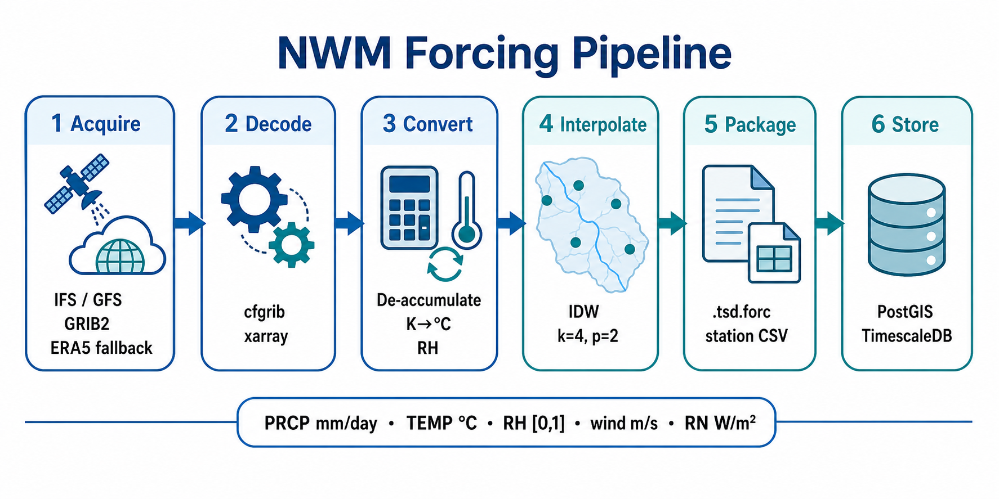
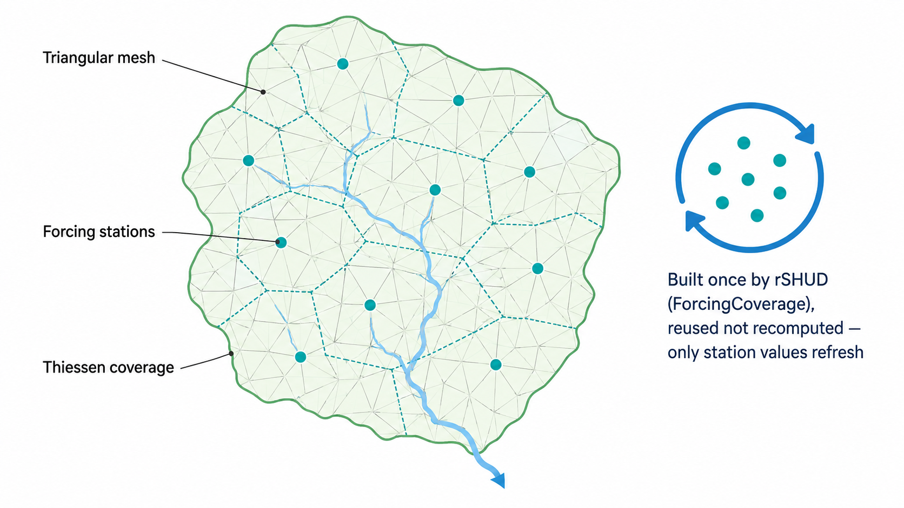
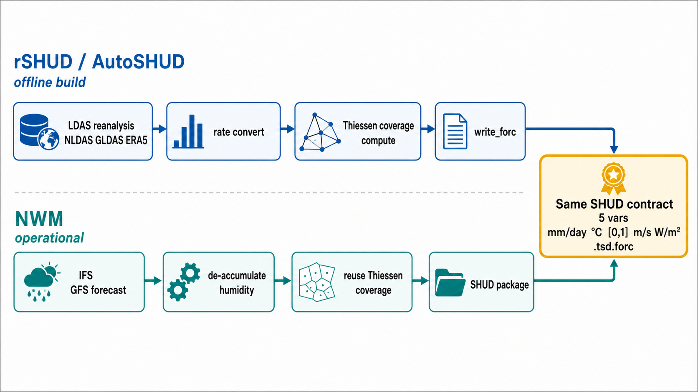

# Forcing 数据处理流程说明 —— 与 rSHUD/AutoSHUD 的一致性与差异

> **目的**：说明本项目（NHMS/NWM 业务化系统）如何生产 SHUD forcing，并逐项对照 rSHUD/AutoSHUD 的离线建模 forcing 流程，论证 legacy IDW 模式与 direct-grid 模式的正确性。
> **可追溯性**：本文所有技术断言均给出仓库内 `文件:行号`，可逐条核对源码。

---

## 0. 结论先行（TL;DR）

本项目产出的 SHUD forcing 文件，在 **文件格式、变量集、单位、时间语义** 上与 rSHUD/AutoSHUD **保持同一 SHUD 契约**；站点↔网格(mesh)耦合关系按流域模型资产的 `forcing_mapping_mode` 分两类：

- legacy `idw`：复用原模型固定 forcing 站点和 `.att`/`FORC` 覆盖关系，运行期把 IFS/GFS canonical 场 IDW 到这些固定站点；
- `direct_grid`：使用已迁移模型资产中的 direct-grid forcing station binding，`.sp.att` 的 `FORC` 已在模型资产构建阶段重算到 IFS/GFS 0.25° 格点站点，运行期按 `grid_cell_id` 精确取 canonical 值，不做 IDW 且不 fallback 到 IDW。

二者相对 rSHUD/AutoSHUD 的共同差异在于：

1. **数据源不同**：rSHUD/AutoSHUD 用 LDAS 再分析（NLDAS/GLDAS/FLDAS/CMFD）+ ERA5；本项目用 **IFS/GFS 业务预报** + ERA5 兜底；
2. **由数据源带来的预处理不同**：IFS/GFS 是预报产品，降水/辐射为**累积场**、湿度以露点或原生 RH 给出，因此本项目额外做了**去累积**与**按源反演湿度**——而这些差异最终都**收敛到同一套 SHUD 契约**。

> 一句话给 leader：legacy `idw` 模式不改 rSHUD/AutoSHUD 建好的站点覆盖，只把固定站点数值换成 IFS/GFS 预报；`direct_grid` 模式则要求模型资产已经前置完成 `.sp.att` `FORC` 迁移，运行期直接复用 IFS/GFS 原始格点对应的 canonical 值。两种模式写出的 forcing 文件都必须满足同一 SHUD 文件格式与单位契约。

### 0.1 维度速查对照表

| 维度 | rSHUD / AutoSHUD（离线建模基线） | 本项目（业务化 forcing） | 是否一致 |
|---|---|---|---|
| 系统定位 | 建模 **+** forcing 一体 | **仅** forcing；legacy `idw` 复用模型覆盖，`direct_grid` 复用已迁移模型资产 | 不同（定位差异） |
| 数据源 | LDAS（NLDAS/GLDAS/FLDAS/CMFD）+ ERA5 | **IFS / GFS** + ERA5 兜底 | **不同** |
| 时段性质 | 历史再分析（逐步速率/均值） | 实时**预报**（累积场） | **不同** |
| forcing 变量集 | Precip / Temp / RH / Wind / RN（5 个） | PRCP / TEMP / RH / wind / Rn（5 个）+ Press（仅入库不写 SHUD） | **一致**（SHUD 取 5 个） |
| 单位 | mm/day, °C, [0,1], m/s, W/m² | mm/day, °C, [0,1], m/s, W/m² | **一致** |
| `.tsd.forc` 索引格式 | `count startdate` / path / `ID Lon Lat X Y Z Filename` | 同结构 | **一致** |
| 每站 CSV | 时间列 + 5 变量列 | `Time_Day Precip Temp RH Wind RN` | **一致** |
| 时间语义 | `startdate=YYYYMMDD` + 相对日序 | `start_date=YYYYMMDD` + `Time_Day`（相对日） | **一致** |
| 站点↔三角元耦合 | `ForcingCoverage` 现算 Voronoi/Thiessen | legacy `idw` 复用原覆盖；`direct_grid` 使用已迁移资产中的 `.sp.att FORC` | 契约一致，资产来源不同 |
| 格点→站点取值 | 站点≈格点中心，最近邻 | legacy `idw` 用 IDW；`direct_grid` 按 `grid_cell_id` exact lookup | 取值方法按模式不同 |
| 阈值钳位 | `rh∈[0,1]`、`prcp<1e-4→0` | `rn<0→0`、`prcp<1e-4→0`、`rh∈[0,1]` | **显式对齐** |

---

## 1. 背景：两条流程的定位差异

**rSHUD / AutoSHUD** 是离线"**建模 + forcing**"一体化工具箱：输入 DEM、河网、土地利用、土壤与 LDAS 气象格点，输出**整套模型**（三角网 mesh、河网、率定参数、forcing 站点与时间序列），见 `AutoSHUD/Step3_BuidModel.R`、`AutoSHUD/Step2_DataSubset.R`。

**本项目** 处理的是**另一个阶段**：在 rSHUD/AutoSHUD 或其它上游流程已经准备好的流域模型资产上生产业务化 forcing，并不在运行期重建 mesh、河网或率定参数。对 legacy `idw` 模式，它只为原固定站点刷新 forcing 时间序列；对 `direct_grid` 模式，它要求上游模型资产已经把 forcing 站点和 `.sp.att FORC` 迁移到 IFS/GFS 格点站点。

- `openspec/changes/m23-qhh-22-production-automation/tasks.md`：记录 **"rSHUD/AutoSHUD 是静态契约参考（static contract reference），SHUD 才是运行时模型引擎"**；forcing 生成"遵循已处理流域的文件契约，但**不 import/调用 rSHUD/AutoSHUD** 作为运行时数据生成器"。
- `docs/runbooks/qhh-backend-smoke.md`：**"forcing 采用原始 qhh / rSHUD 站点表 …… runtime 阶段转换为 `qhh.tsd.forc` 与 `forcing.csv`"**。

**关键不变量**：本项目运行期不自行发明三角元到 forcing 站点的覆盖关系。legacy `idw` 复用原模型 `.att` 的 `FORC` 覆盖；`direct_grid` 复用已迁移模型资产声明的 direct-grid station binding 和 `.sp.att` `FORC` 覆盖，并校验 binding checksum、grid signature、`.sp.att` checksum 与 `FORC` 引用范围。运行期只生产满足 SHUD 契约的站点时间序列。

---

## 2. 本项目 forcing 完整处理流程（逐阶段，文件级）

```
IFS/GFS GRIB2 ──①获取──▶ 规范化 NetCDF ──②解码映射──▶ 单位换算/物理反演 ──③──▶
   canonical 场 ──④按模式映射到 forcing 站点（IDW 或 direct_grid exact lookup）──▶ 站点时间序列 ──⑤写 SHUD 包──▶ .tsd.forc + 每站 CSV ──⑥入库
```



图注：本项目以 IFS/GFS GRIB2 为输入，经 `cfgrib`/`xarray` 解码规范化、单位换算、
去累积与按源湿度反演后，按流域资产声明的 `forcing_mapping_mode` 映射到 forcing 站点。
legacy `idw` 插值到原模型固定站点，`direct_grid` 按 binding 的 `grid_cell_id` 精确取值。
随后写出 SHUD 包（`.tsd.forc` + 每站 CSV）并入库 PostGIS/TimescaleDB。
图内仅表达六阶段结构；精确字段与契约以正文为准，包括 IFS 字段 `2t`/`ssr`/`tp`、
风速公式 `√(u²+v²)`、单位 `mm·day⁻¹`/`°C`/`W·m⁻²`，
以及 `.tsd.forc` 表头 `ID Lon Lat X Y Z Filename`。

### ① 数据获取（data adapters）

| 源 | 文件 | 抓取变量（原生短名） |
|---|---|---|
| IFS（ECMWF） | `workers/data_adapters/ifs_adapter.py:46` | `2t, 2d, 10u, 10v, tp, sp, ssr, str` |
| GFS（NOAA） | `workers/data_adapters/gfs_adapter.py:47` | `tmp2m, apcp, rh2m, u10m, v10m, pressfc, dswrf` |
| ERA5（兜底） | `workers/data_adapters/era5_adapter.py` | 同上对应再分析变量（NetCDF） |

格式均为 GRIB2（ERA5 为 NetCDF），下载时按中国区 bbox 裁剪以减小数据量。

### ② 解码与规范化（canonical converter）

`workers/canonical_converter/converter.py` 用 `cfgrib`/`xarray` 解码，把各源异构短名**统一映射**到规范变量名（`converter.py:46-74`）：

| 规范变量 | IFS 源 | GFS 源 | ERA5 源 |
|---|---|---|---|
| `air_temperature_2m` | `2t` | `tmp2m` | `t2m` |
| `relative_humidity_2m` | 由 `2d` 露点反演 | `rh2m`（原生） | 由露点/比湿反演 |
| `wind_u_10m` / `wind_v_10m` | `10u` / `10v` | `u10m` / `v10m` | `u10` / `v10` |
| `prcp_rate_or_amount` | `tp`（累积 m） | `apcp`（累积 mm） | `tp`（累积 m） |
| `surface_pressure` | `sp` | `pressfc` | `sp` |
| 辐射 | `ssr` 净短波（去累积）→ `Rn` | `dswrf` 下行短波（W/m²）→ `Rn` | `ssr`+`str` 净全波（去累积）→ `Rn` |

### ③ 单位换算与物理量反演（本项目的核心，也是与 rSHUD 差异最集中处）

全部实现于 `workers/canonical_converter/converter.py:687-999`。规范输出单位见 `converter.py:75-94`。

| 物理量 | 本项目处理 | 代码位置 |
|---|---|---|
| 气温 | `K − 273.15 → °C` | `converter.py:706` |
| 降水（IFS/GFS 累积场） | **去累积**：减前一步累积值 → 步长增量；再 `×24/步长(h) → mm/day`；亚阈值微负记 noise 容差 | `converter.py:708-791`（GFS）/`905-961`（IFS） |
| 相对湿度（GFS） | 原生 `rh2m(%) ÷ 100 → [0,1]`，钳位 | `converter.py:810-822` |
| 相对湿度（IFS） | **由露点 Magnus 反演**：`es=exp(17.625·T/(243.04+T))`、`ed=exp(17.625·Td/(243.04+Td))`、`RH=ed/es`，钳位 [0,1] | `converter.py:890-902` |
| 辐射（GFS） | `dswrf` 本就是 W/m²（下行短波），直通 | `converter.py:53,137` |
| 辐射（IFS，业务主源） | **去累积** `ssr` 净短波：`max(0,(ssr(t)−ssr(t−1))/步长秒) → W/m²`（标准量 `shortwave_down`）；另算 `ssr+str` 净全波仅作旁路 | `converter.py:1001-1033` |
| 辐射（ERA5 fallback） | **去累积** `(Δssr+Δstr)/步长秒 → W/m²` 净全波（标准量 `net_radiation`） | `converter.py:861-887` |
| 风速 | u/v 分量分别插值，到站点后 **`wind=√(u²+v²)`** | `workers/forcing_producer/producer.py:1644` |
| 气压 | 直通 Pa（仅入库，不写 SHUD forcing） | — |

> **去累积（de-accumulation）是本项目相对 LDAS 流程多出来的关键步骤**：IFS/GFS 的降水、辐射是"自起报时刻起的累积量"，必须逐步相减还原成该时段的速率/通量；而 LDAS 给的本就是逐步速率/均值，无需此步（见 §3.2）。

#### 辐射 `Rn` 计算方法（按源分口径，统一收敛到 SHUD `Rn` 列，W/m²）

SHUD forcing 第 5 列 `Rn`（rSHUD 记 `RN_w.m2`）在本项目按数据源用不同口径填充，但**都归一到 W/m²**：由 `producer.py:1073` 选取规范辐射量，再乘 `rn_shortwave_factor`（默认 **1.0**，`producer.py:280`）直通（`producer.py:1122-1131`）。

- **GFS**：`dswrf` 本就是 W/m² 下行短波通量，直通进 `Rn`（`converter.py:53,137`）。
- **IFS（业务主源）**：取 ECMWF 累积净太阳辐射 `ssr`（J/m²），**去累积**还原本时段净短波通量 `Rn = max(0, (ssr(t) − ssr(t−1)) / Δt秒)`（`converter.py:1001-1033`，标准量 `shortwave_down`），**不含 `str`**。
- **ERA5（延迟降级 fallback）**：`Rn = (Δssr + Δstr) / Δt秒`，即净全波＝净短波＋净长波（`converter.py:861-887`，标准量 `net_radiation`）。

> 注：converter 对 IFS 也算了 `ssr+str` 净全波（`converter.py:964-998`）并入库，但**它不是 IFS 写 SHUD 的 `Rn`**——IFS 的 `Rn` 只用 `ssr` 净短波（见 `IFS_CANONICAL_TO_FORCING` `producer.py:84-90`、`IFS_REQUIRED_STANDARD_VARIABLES` `converter.py:114`），净全波仅作旁路/诊断并供 ERA5 路复用。

SHUD 模型侧统一对 `Rn` 做 `rn<0→0` 再 `nearbyint` 取整 W/m²（`converter.py:33-34`），故去累积在夜间持平段产生的亚 W/m² 伪负值与 0 逐位等价，不构成数据降级。

**与 rSHUD/AutoSHUD 对齐**：AutoSHUD 各路径喂 `RN_w.m2` 的一律是短波——NLDAS `DSWRF`、CMFD `SRad`、CMIP6 `rsds`（下行短波直通），GLDAS `Swnet`（净短波直通），ERA5 `pmax(ssr.inc/dt, 0)`（净太阳短波去累积，`ERA5_NC2CSV.R:653,659`）。

因此 **GFS `dswrf` ↔ AutoSHUD 下行短波路**、**IFS `ssr` 去累积 ↔ AutoSHUD ERA5 `ssr` 去累积，逐字一致**。唯一差异：本项目 ERA5 fallback 多算了 `str`（净长波，通常为负），若要与 AutoSHUD ERA5 严格一致应去掉 `str`；但该路为非业务主源。

### ④ 空间映射到 forcing 站点（legacy IDW 或 direct_grid）

#### ④-a legacy `idw`：空间插值到固定站点

`workers/forcing_producer/producer.py:1579-1641` `compute_idw_weights()`：

- 固定站点来自数据库 `met.met_station`，仅取 `station_role='forcing_grid'`、`active_flag=true`、有高程者（`producer.py` 仓库层 `store.py:64-96`）；站点的 `shud_forcing_index`、`forcing_filename`、`x/y/z` 存于 `properties_json`；
- 对每个站点取 **k=4** 个最近 NWP 格点（默认 `idw_neighbors=4`），权重 `1/d^p`（**p=2**，`idw_power=2.0`，`producer.py:272-295`），距离用 **haversine**（球面），权重**归一化到 1.0**；站点与格点重合（d≤1e-12°）时退化为该格点权重 1.0。
- 权重持久化到 `met.interp_weight`，便于复用与一致性校验。

#### ④-b `direct_grid`：按 grid_cell_id 精确取 canonical 值

`direct_grid` 是 opt-in 资产模式，只有模型/input manifest 显式声明 `forcing_mapping_mode="direct_grid"` 时启用。该模式要求上游模型资产已经完成：

- direct-grid binding JSON：每个 SHUD forcing station 绑定一个 canonical `grid_id` / `grid_cell_id`；
- manifest 级 `applicable_source_ids`、`binding_checksum`、`grid_signature`、模型 input identity 与 `.sp.att` checksum；
- `.sp.att` 的 `FORC` 已重算到这些 `shud_forcing_index`，且所有 `FORC` 引用都在 `.tsd.forc` `ID` 范围内。

运行期校验上述身份与 checksum 后，按 station binding 的 `grid_cell_id` 精确读取 canonical 值，不计算 IDW 权重、不回退 IDW。物理转换仍然来自 canonical converter，不能直接把原始 GRIB 值写入 SHUD。

`applicable_source_ids` 是 source scope，不是注释字段：GFS 与 IFS 只有在 canonical 产品的 `source_id` 位于该集合内、`grid_id` 与 `grid_signature` 同时匹配时，才允许复用同一 direct-grid binding。`grid_signature` 覆盖有序格点定义；同名 `grid_id` 但经纬度顺序、单元数量或坐标内容改变时，必须视为新网格，旧 binding 失效。

direct-grid 迁移和回滚都通过**模型/input 资产版本**表达。迁移时发布带 `forcing_mapping_mode="direct_grid"`、binding checksum、模型 input package identity、`.sp.att` path/checksum 与 source scope 的新模型资产版本；回滚时重新选择上一版 `idw` 或上一版 direct-grid 资产。不得通过全局 runtime 开关、就地改历史 ready forcing version、或运行期重写 `.sp.att` 来切换模式。

canonical conversion 仍是强制前置步骤，原因是 `grid_cell_id` lookup 只解决“取哪个格点”，不解决“格点值是否已经是 SHUD 所需物理量”。IFS/GFS 原始场仍必须先完成降水/辐射去累积、温度单位换算、湿度反演或归一化、U/V 风速派生、质量标记和 lineage 记录；direct-grid 只能读取这些 canonical 后的格点值。

### ⑤ 写出 SHUD forcing 包

`workers/forcing_producer/producer.py:1689-1751` `format_shud_forcing_package()`：

**索引文件 `qhh.tsd.forc`**（`producer.py:1709-1729`）：

```
<站点数> <起始日YYYYMMDD>
shud
ID    Lon    Lat    X    Y    Z    Filename
<forcing_index>    <lon>    <lat>    <x>    <y>    <z>    <filename.csv>
...
```

**每站时间序列 CSV**（`producer.py:1731-1748`）：

```
<时步数>    6    <起始日>    <结束日>
Time_Day    Precip    Temp    RH    Wind    RN
<相对日>    <mm/day>    <°C>    <[0,1]>    <m/s>    <W/m²>
...
```

其中 `Time_Day = (valid_time − start_time) / 86400`（相对起始日的天数，`producer.py:1735`）。

### ⑥ 入库与产物

写 `met.forcing_version`、`met.forcing_station_timeseries`（TimescaleDB 超表）、`met.interp_weight`，并产出 `forcing_package.json`（含变量集、单位、站点顺序、时间范围、checksum、lineage）。库表定义见 `db/migrations/000005_met.sql:47-112`。

---

## 3. rSHUD / AutoSHUD 的 forcing 处理流程（对照基线）

### 3.1 数据源：LDAS 家族 + ERA5（**无 IFS/GFS**）

AutoSHUD 的 forcing 子流程只覆盖再分析/LDAS：
`AutoSHUD/SubScript/Sub2.3_Forcing_LDAS.R`、`Sub2.3_Forcing_0.4NLDAS.R`、`Rfunction/{GLDAS,NLDAS,FLDAS}_*.R`、`Rfunction/ERA5_NC2CSV.R`、`Rfunction/CMIP6_readnc.R`。**确实没有 IFS/GFS 适配器**——与 leader 的判断一致。

### 3.2 单位换算（`AutoSHUD/Rfunction/LDAS_UnitConvert.R`）

以 NLDAS 为例（`LDAS_UnitConvert.R:1-20`）：

```r
forcnames = c("Precip_mm.d", "Temp_C", "RH_1", "Wind_m.s", "RN_w.m2")
ret = cbind(
  prcp * 86400 / diff_seconds,                 # mm/hr → mm/day（直接按步长换算速率）
  temp - 273.15,                               # K → °C
  rh / 100,                                    # RH 由比湿反演后 → 比值 [0,1]
  abs(winds),                                  # m/s
  solar)                                       # W/m²
# 湿度反演：rh = 0.263*press*SH / exp(17.67*(T-273.15)/(T-29.65))   —— 由【比湿 SH】反演
```

GLDAS（`:49-70`）、CMFD（`:72-94`）同构，仅源字段名与降水换算系数不同（GLDAS `kg/m²/s ×86400`、CMFD `mm/hr ×24`）。**注意 LDAS 的降水/辐射本就是逐步速率或时段均值，故只需一次乘法换算，无需去累积。**

### 3.3 站点覆盖：`ForcingCoverage`（Voronoi / Thiessen）

`rSHUD/R/Func_GIS.R:746` `ForcingCoverage()` 用 `deldir::deldir`（`Func_GIS.R:729`）对气象站点做 **Voronoi/Thiessen 镶嵌**，把每个三角元映射到其最近的 forcing 站点。**这一步在建模阶段做一次，结果固化进模型——本项目正是复用这份覆盖关系，不再重算。**

### 3.4 写出：`write_forc`（`rSHUD/R/io_shud.R:1227-1257`）

```r
.standard_forcing_columns() = c("ID","Lon","Lat","X","Y","Z","Filename")   # io_shud.R:1008
write(paste(nf, startdate), file)   # 第1行：站点数 + 起始日 YYYYMMDD
write(path, append=TRUE)            # 第2行：forcing 子目录
write(colnames(x), ...)             # 第3行：ID Lon Lat X Y Z Filename
write(t(x), ...)                    # 数据行
```

---

## 4. 一致性逐项对照（证据）

### 4.1 `.tsd.forc` 索引：同结构

| 行 | rSHUD `write_forc`（`io_shud.R:1253-1256`） | 本项目（`producer.py:1709-1711`） |
|---|---|---|
| 1 | `<nf> <startdate>` | `<count> <start_date>` |
| 2 | `<path>` | `shud`（即 path 字段，站点 CSV 子目录） |
| 3 | `ID\tLon\tLat\tX\tY\tZ\tFilename` | `ID\tLon\tLat\tX\tY\tZ\tFilename` |
| 4+ | `<id>\t<lon>\t<lat>\t<x>\t<y>\t<z>\t<file>` | `<forcing_index>\t<lon>\t<lat>\t<x>\t<y>\t<z>\t<file>` |

表头列 `ID/Lon/Lat/X/Y/Z/Filename` 与 rSHUD `.standard_forcing_columns()` **逐字节一致**。

### 4.2 每站 CSV 与变量/单位：同契约

| 变量 | rSHUD/AutoSHUD（`LDAS_UnitConvert.R:10`） | 本项目（`producer.py:50-58`, `:1732`） | 单位 |
|---|---|---|---|
| 降水 | `Precip_mm.d` | `Precip` / `PRCP` | mm/day |
| 气温 | `Temp_C` | `Temp` / `TEMP` | °C |
| 湿度 | `RH_1` | `RH` | [0,1] |
| 风速 | `Wind_m.s` | `Wind` / `wind` | m/s |
| 辐射 | `RN_w.m2` | `RN` / `Rn` | W/m² |

**5 个 forcing 变量、单位、顺序完全一致**（SHUD 按列位读取，列名长短不影响）。本项目另有 `Press`（Pa）但**仅入库、不写入 SHUD forcing CSV**（`producer.py:1740-1744` 仅写 PRCP/TEMP/RH/wind/Rn），因此对 SHUD 而言仍是标准 5 变量契约。

> 注：AutoSHUD 自身存在两套列名写法——`LDAS_UnitConvert.R:13` 写 `rh/100`（比值 [0,1]，与 SHUD 契约一致），而旧脚本 `NLDAS_RDS2csv.R:16` 写 `rh`（百分数，注释标 "PERCENTAGE"）。**本项目统一采用 SHUD 权威约定 RH∈[0,1]**，与 `LDAS_UnitConvert.R` 及 `RH_1` 命名一致。

### 4.3 时间语义：一致

二者都用 **`起始日 YYYYMMDD` + 相对日序**：rSHUD `startdate`（`io_shud.R:1227`）；本项目 `start_date`（`producer.py:1704`）+ `Time_Day=相对天数`（`producer.py:1735`），权威定义见 `docs/spec/02_data_product_and_time_semantics.md`。

### 4.4 站点 ↔ mesh 耦合：按模式复用资产

legacy `idw` 通过 `workers/model_registry/qhh_production_bootstrap.py:328-473` `read_qhh_tsd_forc()` **读取原模型的 `.tsd.forc`**，原样保留每个站点的 `forcing_index`、坐标与文件名（`station_id = {project}_forc_{index:03d}`），写入 `met.met_station.properties_json.shud_forcing_index`。
运行时 `workers/shud_runtime/runtime.py:1638-1648` 据此校验 `.att` 的 `FORC` 列。
**站点↔三角元的 Thiessen 覆盖关系是 rSHUD 建模时算好的，legacy `idw` 不重算、不改动。**

`direct_grid` 不复用 legacy 固定站点覆盖，而是复用已迁移模型资产中的 direct-grid station binding 和 `.sp.att` `FORC` 覆盖。该迁移在模型资产构建阶段完成；运行期只校验 binding identity、`.sp.att` checksum、`FORC` 引用范围，并按 `grid_cell_id` 读取 canonical 值。



图注：rSHUD 在建模阶段通过 `ForcingCoverage` 计算 forcing 站点对 mesh 三角元的 Thiessen/Voronoi 覆盖，并把覆盖关系固化到模型 `.att` 的 `FORC` 列；legacy `idw` 复用这份站点↔三角元耦合关系，不重算覆盖，只刷新每个站点 CSV 中的时序数值。`direct_grid` 复用已迁移模型资产中的 `.sp.att FORC` 与格点站点绑定。两种模式的站点索引都遵循 `.tsd.forc` 中 `ID Lon Lat X Y Z Filename` 的固定契约，其中 `ID` 为 `shud_forcing_index`。

### 4.5 阈值/钳位：显式对齐 SHUD/rSHUD

`docs/runbooks/qhh-22-business-bringup.md` 明确记录：**"对齐 SHUD（`rn<0→0`、`prcp<1e-4→0`、`rh∈[0,1]`）/ rSHUD：亚阈值微负记 anomaly 但保 `ok`"**。对应 AutoSHUD `LDAS_UnitConvert.R:82,85`（`rh>100→100`、`p_mm.day<1e-4→0`）。

---

## 5. 差异性及其合理性



图注：上泳道表示 rSHUD/AutoSHUD 的 LDAS 再分析离线流程：逐步速率/均值经一次乘法换算，
在建模时计算 Thiessen 覆盖并由 `write_forc` 写出。下泳道表示本项目的 IFS/GFS 业务预报流程：
累积场先去累积，湿度按源使用原生 RH 或露点反演，再按 `forcing_mapping_mode` 映射到 forcing 站点。
legacy `idw` 复用既有 Thiessen 覆盖并 IDW 到固定站点；`direct_grid` 使用已迁移 `.sp.att FORC`
和 `grid_cell_id` exact lookup。两条流程最终收敛到同一 SHUD 契约：5 个变量
`Precip`/`Temp`/`RH`/`Wind`/`RN`，单位 `mm·day⁻¹`/`°C`/`[0,1]`/`m·s⁻¹`/`W·m⁻²`，
索引文件为 `.tsd.forc`。

| # | 差异 | rSHUD/AutoSHUD | 本项目 | 为什么仍然正确 |
|---|---|---|---|---|
| 5.1 | 数据源 | LDAS 再分析 | IFS/GFS 预报 | 业务化要"预报未来"，再分析只有历史；输出契约不变 |
| 5.2 | **降水/辐射去累积** | 逐步速率，乘法换算即可 | **累积场必须逐步相减**再换算 | 物理必需：IFS/GFS 是累积量；去累积后单位与 LDAS 同为 mm/day、W/m² |
| 5.3 | **湿度反演路径** | 由**比湿** SH 反演（Bolton 系数 17.67/243.5） | GFS 用**原生 RH**；IFS 由**露点** Magnus 反演（A-E 系数 17.625/243.04） | 同一物理量 RH 的等价反演，殊途同归；两套 Magnus 系数差异 <0.4% RH，均为公认标准 |
| 5.4 | 风速 / 辐射严格度 | NLDAS 脚本 `abs(UGRD)`（仅 u 分量）；辐射有时取净有时取下行 | 风速 **`√(u²+v²)`**；IFS 辐射取 `ssr` 净短波严格去累积成 W/m² | 风速更严格（全模长 vs 仅 u）；辐射与 AutoSHUD ERA5（`ssr` 净短波去累积）**同口径** |
| 5.5 | 格点→站点取值 | 站点≈格点中心，最近邻 | legacy `idw`：IDW（k=4, p=2）；`direct_grid`：按 `grid_cell_id` exact lookup | legacy IDW 保留标准空间插值；direct-grid 把归属前移到模型资产，运行期避免插值成本和插值误差 |

> **要点**：5.2–5.4 这些"多出来的处理"，恰恰是因为 IFS/GFS 作为**预报产品**给的是累积量与不同的湿度变量；本项目针对性地做了去累积与按源反演，**而且在风速、辐射上比 AutoSHUD 的 LDAS 脚本做得更严谨**。所有差异最终都收敛到**同一套 SHUD 五变量契约**。

---

## 6. 正确性保证（如何确证）

1. **单元测试**（`tests/test_forcing_producer.py`）：
   - legacy IDW 权重按站点归一化到 1.0、非负（`:259-279`）；
   - 高纬距离按球面缩放（`:282-299`）；
   - 风速 `√(u²+v²)`（`:302-303`）；
   - **SHUD 包格式**：`qhh.tsd.forc` 头、按 `shud_forcing_index` 排序、每站 CSV、`forcing_package.json` 的 `units` 断言 `{PRCP:mm/day, TEMP:degC, RH:0-1, wind:m/s, Rn:W/m2, Press:Pa}`（`:323-382`）。
2. **node-22 真实 SHUD 运行 oracle**：forcing 包最终由 `workers/shud_runtime/runtime.py` 喂给真实 SHUD 二进制执行（CLAUDE.md 规定 node-22 为 SHUD 行为权威），即"能被 SHUD 正确读入并跑出结果"是端到端验收。
3. **阈值/语义对齐有据**：`docs/runbooks/qhh-22-business-bringup.md`、`docs/spec/02_data_product_and_time_semantics.md`。
4. **逐字节格式同构有据**：本文 §4 全部给出 rSHUD 源码与本项目源码的并排行号，可直接 `diff` 复核。

---

## 7. 结论

- **格式/变量/单位/时间**：本项目与 rSHUD/AutoSHUD 使用同一 SHUD forcing 契约，写出的 `.tsd.forc` 与每站 CSV 与 rSHUD `write_forc` 同构，SHUD 可无差别读入。
- **差异**：仅在数据源（IFS/GFS 预报 vs LDAS 再分析）及由此必需的预处理（去累积、按源反演湿度）；这些差异是业务化的物理必然，且本项目在风速、辐射处理上更严格。
- **运行期不改覆盖**：mesh、河网、率定参数由模型资产提供；legacy `idw` 复用 rSHUD 建模产物的站点↔三角元覆盖，只刷新固定站点时序；`direct_grid` 复用已迁移模型资产的 `.sp.att FORC` 与格点站点绑定，只按 `grid_cell_id` 写时序。

> **核验路径**：直接对照本文 §4.1（`rSHUD/R/io_shud.R:1227` vs `workers/forcing_producer/producer.py:1689`）与 §4.2（`AutoSHUD/Rfunction/LDAS_UnitConvert.R:10` vs `producer.py:1732`）即可在源码层面确认一致；§5 表格逐项解释每一处差异及其物理依据。

---

## 8. API 直读 disk

station-series 读侧自 PR-B #628 起直接读取 forcing producer 写出的 SHUD station CSV：
`apps/api/routes/data_sources.py:136-174` 的 `/met/stations/{station_id}/series` route 调用
`packages/common/object_store_forcing.py:342-436` `read_station_forcing_csv()`，而不是旧的
`PsycopgForecastStore.station_series()`。该变化只影响 API 读路径，不改变本文 §2 的 forcing 生产流程，
也不改变 rSHUD/AutoSHUD 对齐结论。

路径模板与 SHUD 包布局一致：`packages/common/object_store_forcing.py:219-230` 按
`OBJECT_STORE_ROOT/forcing/{source}/{YYYYMMDDHH}/{basin_version_id}/{model_id}/shud/{forcing_filename}` 解析文件；
`source_id` 归一化为 lowercase，`cycle_time` 转 UTC 后格式化为 `YYYYMMDDHH`
（`object_store_forcing.py:207-216`）。node-27 当前期望 `OBJECT_STORE_ROOT=/home/ghdc/nwm/object-store`，
因此一个典型叶子文件是
`/home/ghdc/nwm/object-store/forcing/ifs/2026062012/basins_heihe_vbasins/basins_heihe_shud/shud/X100.75Y37.65.csv`。

DB 仍只承担 station metadata lookup：`PsycopgStationLookup` 查询 `met.met_station` 的 `station_id`、
`basin_version_id`、坐标、高程、角色、active flag 和 `properties_json`（`object_store_forcing.py:180-204`），
其中 `properties_json.forcing_filename` 是 station→CSV 的解析键。序列值不再查
`met.forcing_station_timeseries`，也不再用 `met.forcing_version` 的 checksum/finalize 状态做 gate；
这解释了为什么 PR-B #628 可以让 latest cycle 在 disk CSV 已存在但 DB finalize 未完成时返回 200。

CSV 契约仍是本文 §4.2 的 SHUD 五变量格式。reader 要求首行是 `nrow ncol start_date end_date`，
列头包含 `Time_Day Precip Temp RH Wind RN`（`object_store_forcing.py:252-278`）；
输出变量顺序和单位仍为 `PRCP mm/day`、`TEMP degC`、`RH 0-1`、`wind m/s`、`Rn W/m^2`。
`Time_Day` 由相对日起点换算为 UTC `valid_time`，所以 API 返回的是标准 `StationSeriesResponse`，
不是另一套业务格式。

错误语义也随读侧切换而改变：`STATION_NOT_FOUND` 和 `MISSING_REQUIRED_FILTER` 继续复用既有 404/422 形状
（`object_store_forcing.py:439-468`）；新增 disk 相关错误为 `STATION_FORCING_FILENAME_MISSING`、
`STATION_FORCING_FILE_NOT_FOUND`、`STATION_FORCING_FILE_MALFORMED`（`object_store_forcing.py:95-148`）。
旧 DB-backed 路径的 `FORCING_VERSION_NOT_FOUND` / `FORCING_VERSION_NOT_FINALIZED` 不应再从该 route 产生。

该 API 是 disk-only：如果 cycle 已超出 `/home/ghdc/nwm/object-store/forcing/{source}/` 的保留窗口，
即使 DB 里仍有历史 forcing rows，也返回 404 `STATION_FORCING_FILE_NOT_FOUND`，
不 fallback 到 `met.forcing_station_timeseries`。这是一条读侧一致性边界：
展示面只承诺读取当前 object-store mirror 中仍存在的 SHUD CSV；长期历史回看如需 DB 路径，应另立 API 契约。

role boundary 同步调整为“display 可以只读 `OBJECT_STORE_ROOT`”：`apps/api/runtime_mode.py:247-264`
要求 `display_readonly` 启动时配置可读、可遍历的 `OBJECT_STORE_ROOT`，但不要求可写。
该放开只覆盖共享 object-store mirror 的只读访问，不改变 display 不运行 producer/Slurm/orchestrator、
不写业务终态的边界。

---

### 附：关键源码索引

| 主题 | 文件:行 |
|---|---|
| IFS 抓取变量 | `workers/data_adapters/ifs_adapter.py:46` |
| GFS 抓取变量 | `workers/data_adapters/gfs_adapter.py:47` |
| 规范变量映射 | `workers/canonical_converter/converter.py:46-94` |
| 单位换算/去累积/湿度反演 | `workers/canonical_converter/converter.py:687-999` |
| legacy IDW 插值 | `workers/forcing_producer/producer.py:1579-1641` |
| 风速合成 | `workers/forcing_producer/producer.py:1644` |
| SHUD 包写出 | `workers/forcing_producer/producer.py:1689-1751` |
| forcing 变量与单位 | `workers/forcing_producer/producer.py:50-58` |
| 站点表读取（复用 .tsd.forc） | `workers/model_registry/qhh_production_bootstrap.py:328-473` |
| 运行时 .att FORC 重映射 | `workers/shud_runtime/runtime.py:1638-1648` |
| 库表 schema | `db/migrations/000005_met.sql:47-112` |
| rSHUD `write_forc` | `rSHUD/R/io_shud.R:1227-1257` |
| rSHUD 标准列 | `rSHUD/R/io_shud.R:1008-1010` |
| rSHUD `ForcingCoverage`（Thiessen） | `rSHUD/R/Func_GIS.R:746-763` |
| AutoSHUD LDAS 单位换算 | `AutoSHUD/Rfunction/LDAS_UnitConvert.R:1-94` |
| 单元测试 | `tests/test_forcing_producer.py:259-398` |
| 时间语义规范 | `docs/spec/02_data_product_and_time_semantics.md` |
| 阈值对齐 runbook | `docs/runbooks/qhh-22-business-bringup.md` |
| API 直读 disk route | `apps/api/routes/data_sources.py:136-174` |
| object-store station CSV reader | `packages/common/object_store_forcing.py:342-436` |
