# 全国水文模拟系统建设方案汇报

**汇报日期**：2026年5月4日  
**系统名称**：全国水文模拟系统  
**文档版本**：v1.0  

---

## 一、建设背景与目标

全国水文模拟系统面向全国多流域、多资料源、多模型版本的业务化水文模拟和预报需求，以 SHUD 分布式水文模型为核心计算引擎，围绕**气象资料接入 → forcing 生产 → 真实场状态运行 → 预报运行 → 结果入库 → 洪水重现期产品 → 地图展示**构建完整的业务化流水线。

系统建设的核心定位是一套**可审计、可追溯、可回滚、可扩展**的业务平台——每个资料周期、每个流域模型、每次 SHUD 作业、每条河段结果、每套洪水频率曲线均具备明确的版本与血缘关系。

### 1.1 建设范围

**系统涵盖内容：**

- GFS、IFS、ERA5、CLDAS 等多源气象资料的适配与接入
- 原始数据发现、下载、校验、归档的自动化流程
- 统一气象中间产品（Canonical Meteorological Product）生产
- SHUD 模型 forcing 站点数据生产
- 流域版本、河网版本、mesh 版本、率定版本的全生命周期管理
- Analysis Run（真实场/再分析驱动的连续状态更新）
- Forecast Run（多源预报驱动的未来 7 天水文预报）
- Slurm + HPC 高性能计算调度
- SHUD 输出解析与结构化入库
- 洪水频率/重现期产品的自动化生产
- PostGIS / TimescaleDB / 对象存储 / 瓦片服务的数据管理体系
- 前端全国地图、气象图层、水文图层、交互式曲线展示

**暂不纳入范围：**

- 水库群调度、闸坝调度、二维淹没推演
- 业务预警发布责任流程
- 全国所有流域的模型率定工作本身（系统负责管理已率定模型）

---

## 二、系统总体架构

系统采用**四平面分层架构**，实现业务状态管理与重计算作业的解耦，确保控制平面轻量高可用，HPC 计算平面可水平扩展。

**四大架构平面：**

| 平面       | 核心职责                                     |
| -------- | ---------------------------------------- |
| 业务控制平面   | 资料源管理、任务状态机、元数据服务、API 网关、前端发布            |
| HPC 计算平面 | 资料下载、forcing 生产、SHUD 模型运行、结果解析、频率计算      |
| 存储平面     | PostgreSQL/PostGIS、TimescaleDB、对象存储、瓦片存储 |
| 前端展示平面   | 全国地图、时间轴控件、图层控制、交互式曲线展示                  |

**系统架构总览如下图所示：**

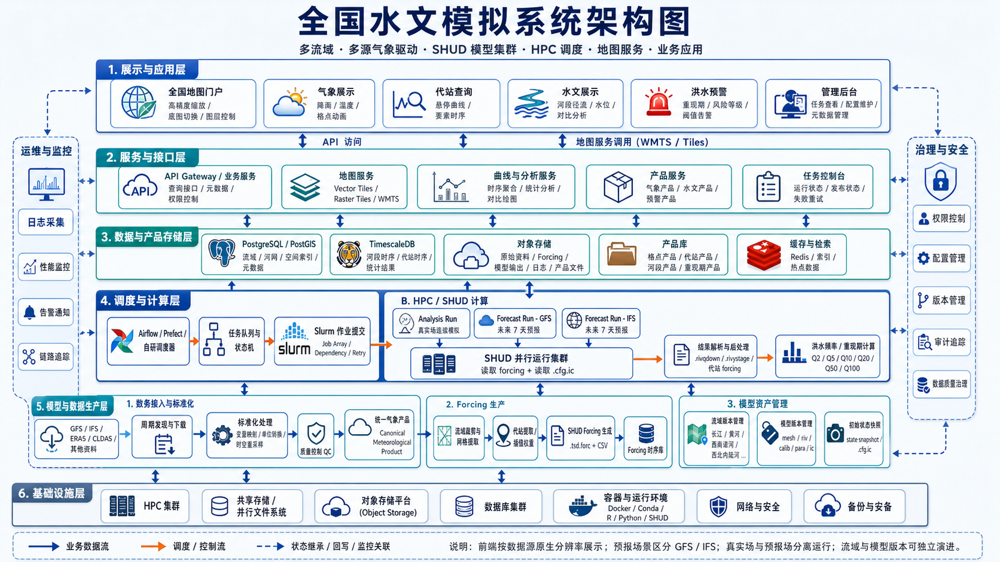

架构图展示了从基础设施层、调度与计算层、数据与产品存储层、服务与接口层到前端应用层的完整技术栈，以及运维与安全的横向支撑体系。系统通过 Slurm 作为所有模型运行的唯一入口，Web/API 服务仅负责编排、登记、查询与发布，不直接执行 SHUD 计算。

---

## 三、业务流程与数据流转

### 3.1 端到端业务流程

系统的核心业务流程覆盖从气象数据接入到前端展示的完整链路，具体数据流转如下图所示：

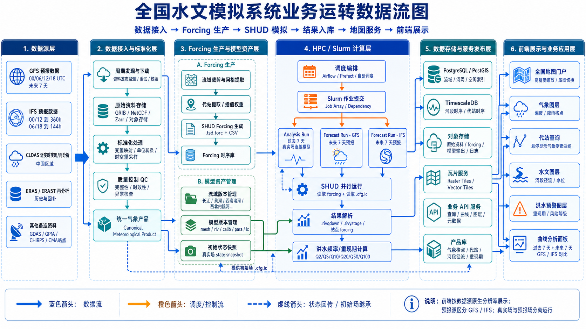

业务流转图清晰展示了六大环节：**数据源层 → 数据接入与标准化处理 → Forcing 生产与模型资产库 → HPC/Slurm 计算层 → 数据库与瓦片服务 → 前端地图与业务展示**，蓝色箭头标识数据流，橙色箭头标识调度/控制流，虚线箭头标识状态回传与初始场继承。

### 3.2 Analysis 与 Forecast 分离运行机制

系统将水文模拟分为两条独立的运行链路：

**Analysis Run（真实场状态运行）：**
- 利用真实场或再分析资料（ERA5、CLDAS 等）连续驱动 SHUD 模型
- 持续更新流域水文状态，生成 StateSnapshot（状态快照）
- 产出过去 7 天的河段径流、水位等时序结果

**Forecast Run（预报运行）：**
- 基于 GFS、IFS 等数值天气预报资料
- 从最近的 StateSnapshot 热启动（warm-start）
- 产出未来 7 天的河段径流、水位预报
- 运行完成后自动计算洪水重现期产品

前端展示时，Analysis 段与 Forecast 段自动拼接为"过去 7 天 + 未来 7 天"的完整曲线，并明确标注分界线与资料来源。

### 3.3 多 Scenario 并行预报

系统支持 GFS、IFS 等多个预报源的独立运行和对比展示：

| 场景（Scenario） | 含义 |
|---|---|
| `analysis_true_field` | 真实场/再分析驱动的历史结果 |
| `forecast_gfs_deterministic` | GFS 确定性预报 |
| `forecast_ifs_deterministic` | IFS 确定性预报 |
| `forecast_best_available` | 按优先级融合的业务产品 |

GFS 与 IFS 的预报结果分别保存、分别展示、可对比分析，所有派生产品均保留完整的数据血缘关系。

---

## 四、数据体系设计

### 4.1 核心数据实体关系

系统围绕流域、模型、气象资料、水文运行、洪水频率等核心业务对象建立了完整的数据关系模型，如下图所示：

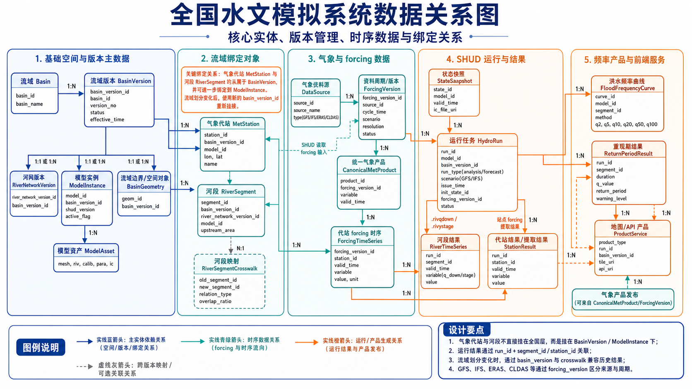

数据关系图展示了五大实体域的逻辑关联：**基础空间与版本主数据 → 流域模型与率定 → 气象与 Forcing 数据链 → SHUD 运行与输出链 → 统计产品与气象产品**，所有空间和统计产品均绑定版本，确保数据可追溯、可审计。

### 4.2 气象数据源体系

系统已完成对主要气象数据源的全面梳理与接入方案设计，涵盖预报资料、再分析资料、卫星降水和气象站观测四大类别：

| 数据角色 | 推荐主数据源 | 备用/扩展数据源 | 接入策略 |
|---|---|---|---|
| 未来 0–7 天预报 forcing | GFS（0.25°） | IFS Open Data | GFS 作为 MVP 主链路；IFS 并行接入 |
| 过去 0–7 天真实场 forcing | CLDAS-V2.0 | ERA5、GDAS、GPM IMERG | CLDAS 权限开通前，先用 ERA5 + GFS 组合 |
| 历史长期 forcing | ERA5 | ERA5-Land、CHIRPS | 用于率定、长期 analysis、洪水频率样本 |
| 降水校验/补充 | CLDAS 降水 | GPM IMERG、CHIRPS | 多源降水对比与偏差订正 |

所有气象数据源最终统一转换为 Canonical Meteorological Product（标准气象中间产品），再由 Forcing 生成器映射为 SHUD 可读的 forcing 文件，确保模型运行与原始数据格式解耦。

### 4.3 数据库架构

系统采用 **PostgreSQL/PostGIS + TimescaleDB + 对象存储** 的混合存储方案：

| 存储层 | 职责 | 典型数据 |
|---|---|---|
| PostgreSQL/PostGIS | 空间对象、元数据、版本管理、频率曲线 | 流域边界、河网、模型实例、洪水频率参数 |
| TimescaleDB | 高频时间序列 | 河段径流/水位时序、forcing 站点时序、重现期时序 |
| 对象存储 | 大体量文件 | 原始气象资料、SHUD 输入输出、日志、瓦片 |

数据库按业务域分为六个 Schema：`core`（核心对象）、`met`（气象资料）、`hydro`（水文运行）、`flood`（频率与重现期）、`map`（瓦片发布）、`ops`（作业运维）。

---

## 五、HPC 计算调度设计

### 5.1 Slurm 作业体系

系统通过 Slurm Gateway 统一管理所有重计算任务，Web/API 服务不直接执行 SHUD 模型。所有作业均由 manifest（作业清单）驱动，支持独立重跑和失败恢复。

**主要作业类型：**

| 作业类型 | 说明 |
|---|---|
| 资料下载与校验 | 下载 GFS/IFS/ERA5 等原始资料并完成完整性校验 |
| 标准化转换 | 转换为 Canonical Meteorological Product |
| Forcing 批量生产 | 对每个流域/模型生成 forcing 数据包 |
| SHUD Analysis 批量运行 | 真实场状态运行 |
| SHUD Forecast 批量运行 | 多源预报运行 |
| 输出解析与入库 | 批量解析 SHUD 输出并写入时序数据库 |
| 洪水频率计算 | 批量计算重现期产品 |
| 瓦片发布 | 生成并发布前端可视化瓦片 |

### 5.2 作业调度流程

作业之间通过 Slurm 依赖链自动编排，单个流域失败不会阻断其他流域的入库和发布：

```
资料下载 → 标准化转换 → Forcing 批量生产 → SHUD 批量运行 → 输出解析 → 频率计算 → 瓦片发布
```

每个环节均支持幂等执行和失败重跑，所有中间产物带 checksum 校验，确保数据完整性。

---

## 六、前端应用设计

前端采用 **MapLibre GL JS + ECharts** 技术栈，基于矢量瓦片和栅格瓦片实现全国尺度的高性能地图展示。以下逐一展示各核心功能界面的设计方案。

### 6.1 全国总览视图

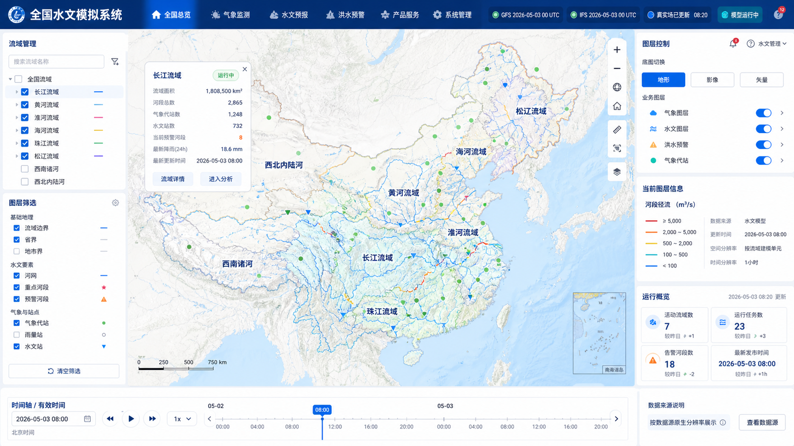

全国总览视图为系统默认首页，展示全国河网径流分布、流域边界、重现期等级色标等核心信息。左侧提供流域管理与图层树，右侧显示图层控制与统计摘要，底部为跨数据源的统一时间轴控件。用户可快速掌握全国水文态势。

### 6.2 流域详情与河段交互视图

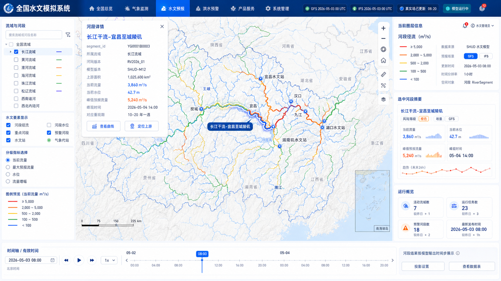

进入流域视图后，河网根据径流量/重现期等级进行色标渲染。用户点击任意河段，左侧弹出河段详情面板，展示河段基本属性、当前流量、重现期等级等关键指标；右侧显示该河段径流趋势小图与预警统计。该视图支持河段 hover 高亮与 click 详情两级交互。

### 6.3 河段预报曲线详情视图

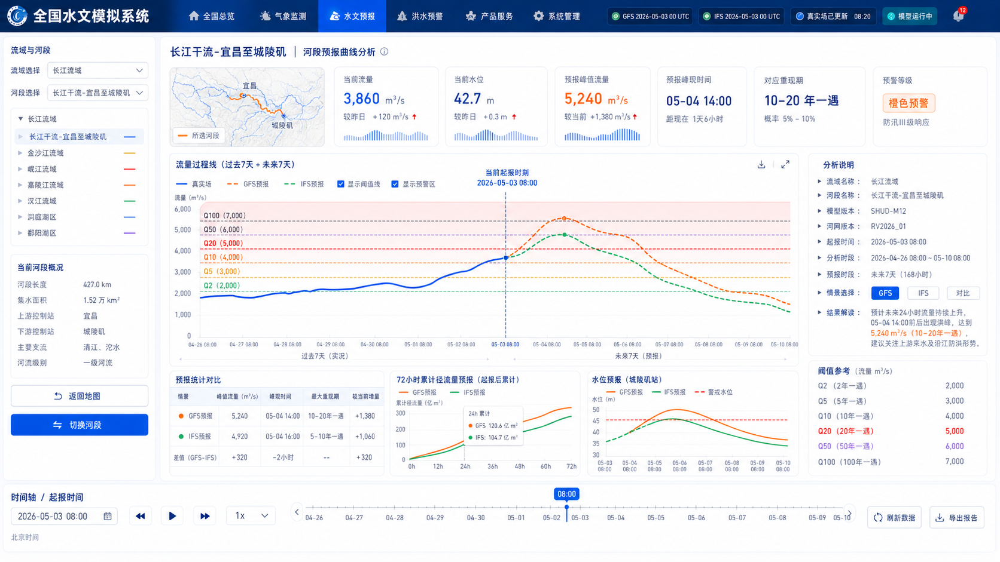

点击河段后可展开完整的预报曲线详情页面。核心图表展示"过去 7 天 Analysis 实况 + 未来 7 天 Forecast 预报"的拼接曲线，同时叠加 Q2/Q5/Q10/Q20/Q50/Q100 洪水频率阈值线。支持 GFS、IFS 等多 Scenario 对比显示，左侧提供该河段所属气象代站的 forcing 时序（降水、温度、湿度等），方便研究人员追溯气象驱动与水文响应的对应关系。

### 6.4 洪水预警总览视图

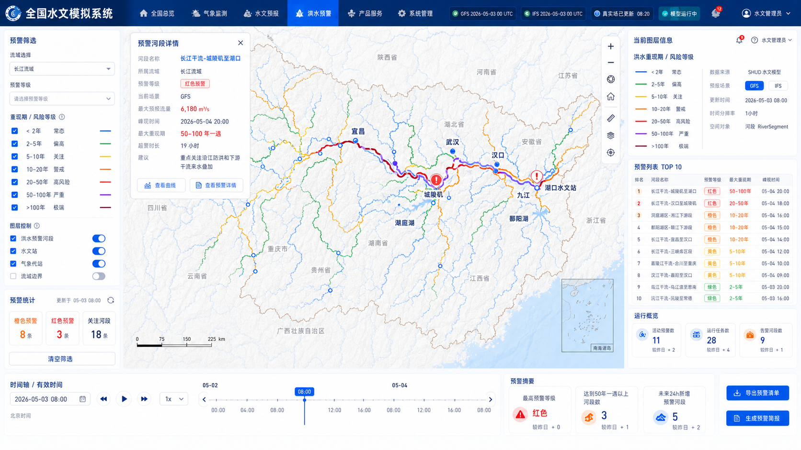

洪水预警总览视图将重现期产品以空间化方式展示于地图之上，河段按重现期等级（常态/偏高/关注/警戒/高风险/严重/极端）进行分级着色。顶部提供关键预警河段的滚动信息条，左侧展示预警等级统计，方便快速识别全流域范围内的高风险区域。

### 6.5 气象数据空间展示视图

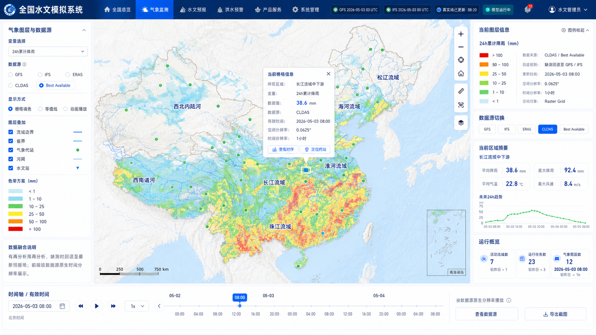

气象数据展示视图以栅格瓦片形式在地图上渲染降水、温度等气象要素的空间分布。支持 GFS、IFS、ERA5、CLDAS 等多源数据的切换与对比，右侧提供气象监控面板和站点校验信息。时间轴按各数据源的原生时间分辨率展示，不做强制统一插值。

### 6.6 气象代站查询视图

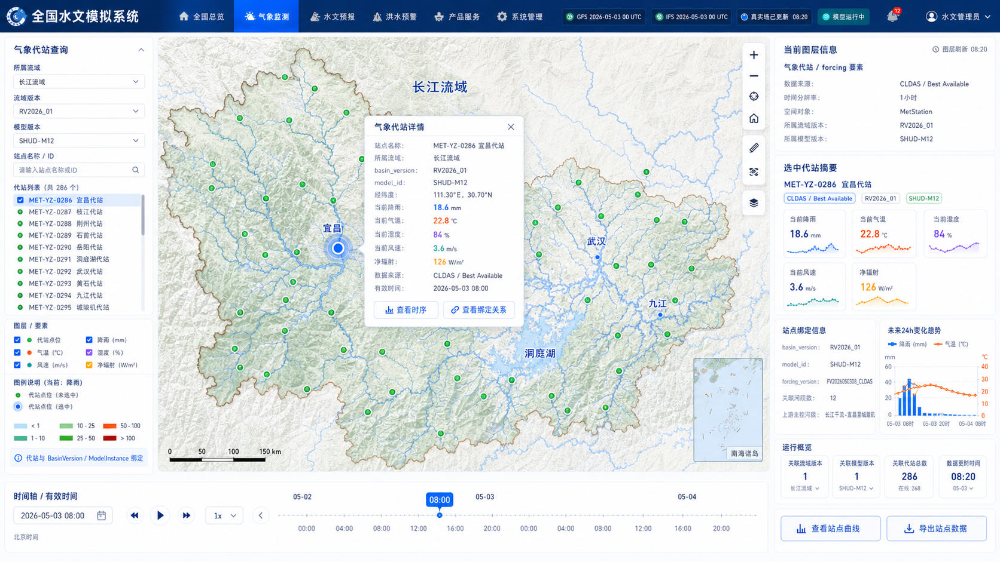

气象代站查询视图支持按流域筛选气象代站，点击站点后弹出详情面板，展示该站点的降水（PRCP）、气温（TEMP）、相对湿度（RH）、风速（wind）、净辐射（Rn）、气压（Press）等完整 forcing 时序。右侧提供数据来源标识（Forcing / Best Available）和质量标识信息，方便对 forcing 数据进行质控追溯。

### 6.7 流域与模型资产管理视图

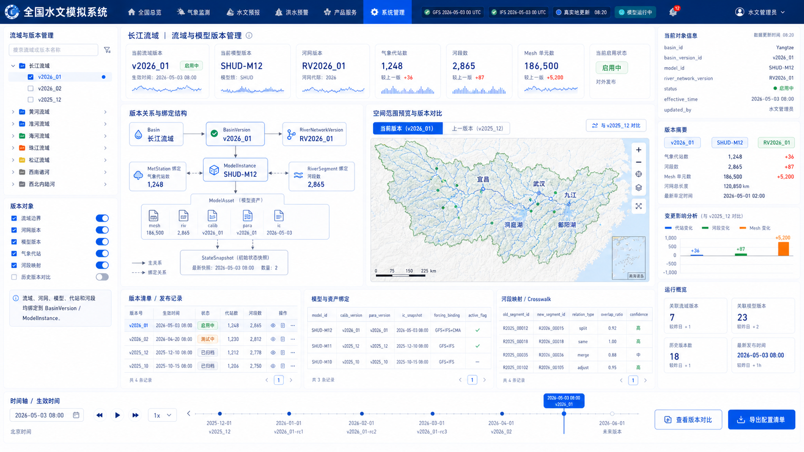

模型资产管理视图提供流域版本、河网版本、mesh 版本、率定版本、SHUD 代码版本的全生命周期管理界面。展示当前激活的模型实例及其关键参数（河段数、节点数、流域面积等），支持版本对比和历史版本回溯。该功能确保模型版本变化可追踪，历史结果不因版本切换而丢失。

### 6.8 产品监控与运行状态视图

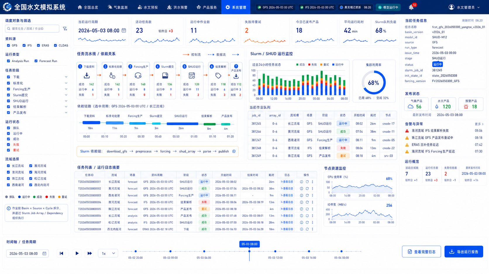

产品监控视图面向系统运维和业务监控，展示当前起报周期的流水线执行状态（下载 → 转换 → forcing → 运行 → 解析 → 发布）、各环节耗时统计、Slurm 作业队列状态、成功/失败率等关键运维指标。右侧提供性能趋势图和近期作业列表，支持快速定位异常并触发重跑操作。

---

## 七、数据质量控制体系

系统在数据链路的关键节点建立了三级质量控制机制：

### 7.1 气象 Forcing 质量控制

- 降水非负校验、温度范围合理性校验
- 相对湿度范围校验（0–1）、风速非负校验
- 时间轴连续性检查，缺失段明确标记
- 单位转换记录完整保留在 lineage 字段

### 7.2 SHUD 输出质量控制

- 输出文件完整性检查（列数与河段数一致）
- 时间步数与 manifest 一致性验证
- NaN/Inf 异常值检测
- 关键出口河段流量异常尖峰标记（仅标记，不自动删除）

### 7.3 洪水频率质量控制

- 样本年数满足最小阈值要求
- 拟合参数有效性验证
- 频率值单调性检查（Q2 < Q5 < Q10 < ... < Q100）
- 不满足质量标准的河段标记 `quality_flag`，前端标注"数据不充分"

---

## 八、系统安全与运维

### 8.1 环境与部署

系统划分为 dev（开发）、staging（预生产）、prod（生产）、hpc（计算）四套独立环境。控制平面服务采用容器化部署，HPC 侧使用 Singularity/Apptainer 固定 SHUD 及依赖版本。

### 8.2 安全设计

- Slurm Gateway 仅接受固定命令模板，不执行任意 shell
- 所有 manifest 经过 schema 校验后方可提交
- 作业用户与 Web 用户严格隔离
- 生产数据目录实行白名单路径访问控制
- 日志脱敏处理，不记录访问密钥
- 前端仅通过 API 和瓦片服务访问数据，不直接连接数据库

### 8.3 权限体系

| 角色 | 权限范围 |
|---|---|
| viewer | 查看已发布的地图和曲线 |
| analyst | 查看 QC 标识、历史版本、下载结果数据 |
| operator | 触发重跑、取消作业、重新发布产品 |
| model_admin | 注册模型版本、切换激活模型 |
| sys_admin | 管理数据源、用户权限、系统配置 |

---

## 九、建设路线与里程碑

系统建设分为六个阶段，逐步实现从单流域验证到全国业务化运行的完整能力：

| 阶段 | 建设内容 | 核心验收标准 |
|---|---|---|
| **阶段 0：项目初始化** | 代码仓库、开发规范、CI/CD、基础数据库与对象存储 | 开发环境可本地启动，数据库迁移可重复执行 |
| **阶段 1：GFS + 单/双流域 Forecast 闭环** | GFS 适配器、forcing 生产、模型运行、输出解析、前端曲线展示 | 至少一个流域完成未来 7 天 GFS 预报，前端可展示河段曲线 |
| **阶段 2：Analysis Run 与 Warm-start** | ERA5 适配器、Analysis 流水线、状态快照管理、前端 Analysis+Forecast 拼接 | Analysis 产出状态快照，Forecast 使用最新快照热启动 |
| **阶段 3：Slurm 全国化** | 资源配置、Job Array 模板、作业依赖状态机、运行监控 | ≥10 个流域模型可并行调度，单流域失败不阻断其他流域 |
| **阶段 4：IFS 与多 Scenario** | IFS 适配器、多 Scenario 查询与展示、GFS/IFS 对比曲线 | 同一河段同时展示 GFS 和 IFS 预报曲线 |
| **阶段 5：洪水频率/重现期产品** | 历史样本生产、频率拟合、阈值表、重现期计算与前端着色 | 已启用河段均有频率曲线，预报完成后自动计算重现期 |

后续根据 CLDAS 数据权限开通进度，适时启动阶段 6（CLDAS 近实时真实场接入），进一步提升真实场驱动的时效性与精度。

---

## 十、风险识别与应对

| 风险项 | 影响评估 | 应对措施 |
|---|---|---|
| CLDAS 数据权限尚未取得 | 真实场质量与时效受限 | 适配器预留，先用 ERA5 + GFS/GDAS 替代 |
| IFS 06/18 周期预报时效不足 7 天 | 前端未来 7 天曲线不完整 | 标记可用时效范围，必要时用 00/12 周期补齐 |
| 全国流域模型规模差异大 | HPC 资源分配不均衡 | Slurm Job Array 加并发上限与 per-model 资源配置 |
| 河网版本变化 | 历史结果不可直接跨版本对比 | 建立河段交叉映射表，频率曲线按版本重新计算 |
| SHUD 二进制输出解析复杂度 | 入库失败或性能瓶颈 | 标准解析器 + 原始输出保留，解析可独立重跑 |
| 洪水频率样本年数不足 | 重现期结果不稳定 | 标记质量等级，不足年限不产出高等级重现期 |

---

## 十一、总结

全国水文模拟系统从多源气象资料接入、统一数据标准化、SHUD 分布式水文模型运行、HPC 高性能调度、洪水频率产品生产到前端 GIS 交互展示，构建了一条完整的、可审计的业务化水文预报流水线。系统在架构上实现了控制平面与计算平面的解耦，在数据管理上建立了全链路版本管理与血缘追溯机制，在前端交互上提供了从全国总览到河段级别的多层次分析能力。

建设路线按照"先跑通核心链路、再扩展数据源与流域覆盖"的务实策略推进，确保每个阶段均有明确可验收的交付成果。后续工作将围绕气象数据权限落实、全国流域模型的逐步接入、以及洪水频率产品的精度提升持续推进。

---

*本文档基于《全国水文模拟系统：总体设计与模块开发 Spec v0.1》及配套设计图编制。*
