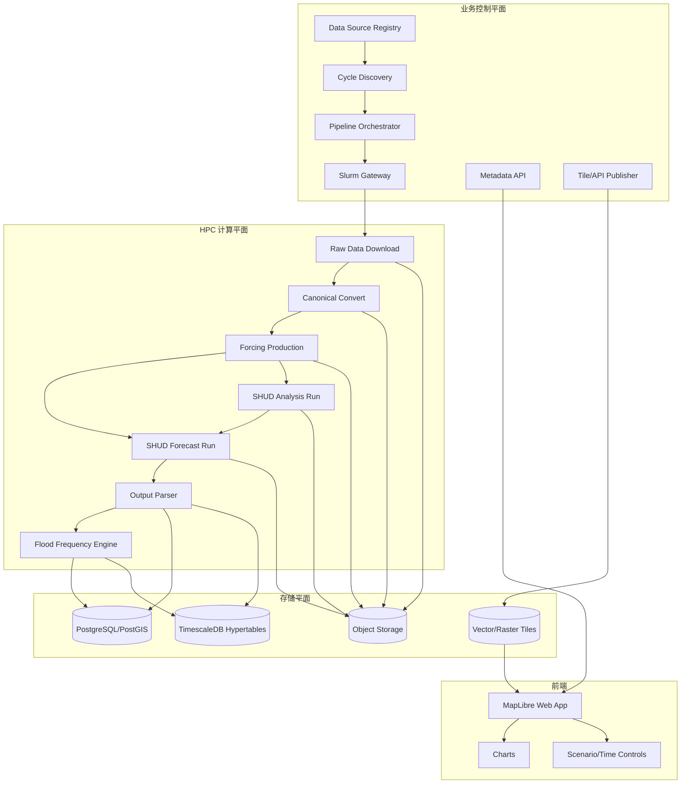

# 00. 总体设计方案

版本：v0.1  
日期：2026-04-30  
系统名称：**全国水文模拟系统**

## 1. 建设目标

全国水文模拟系统面向全国多流域、多资料源、多模型版本的业务化水文模拟和预报。系统以 SHUD 为核心水文模型，围绕“气象资料接入—forcing 生产—真实场状态运行—预报运行—结果入库—洪水重现期产品—地图展示”形成稳定流水线。

系统不应被设计成一次性脚本集合，而应设计成可审计、可追溯、可回滚、可扩展的业务平台。每个资料周期、每个流域模型、每次 SHUD 作业、每条河段结果、每套洪水频率曲线都要有明确版本与血缘关系。

## 2. 范围

### 2.1 系统包含

- GFS、IFS、ERA5、CLDAS 等气象资料源的适配层。
- 原始数据发现、下载、校验、归档。
- 统一气象中间产品 Canonical Meteorological Product。
- SHUD forcing 站点数据生产，包括 `.tsd.forc` 和 forcing CSV。
- SHUD 模型资产、流域版本、河网版本、mesh 版本、率定版本管理。
- Analysis run：用真实场 / 再分析 forcing 连续更新模型状态。
- Forecast run：用 GFS、IFS 等预报 forcing 从最新真实场状态启动未来 7 天预报。
- Slurm + HPC 调度接口。
- SHUD 输出解析和入库，重点是 `.rivqdown`、`.rivystage`。
- 洪水频率 / 重现期曲线和预报期重现期产品。
- PostGIS / TimescaleDB / 对象存储 / 瓦片服务。
- 前端全国地图、气象图层、水文图层、河段点击曲线、气象代站悬浮曲线。

### 2.2 系统暂不包含

- 水库群调度、闸坝调度、二维淹没推演。
- 业务预警发布责任流程。
- 资料权限采购本身。
- 全国所有流域的模型率定工作本身；系统只管理已率定模型和模型版本。

## 3. 核心业务对象

| 对象 | 含义 |
|---|---|
| DataSource | 气象资料源，如 GFS、IFS、ERA5、CLDAS。 |
| ForecastCycle | 一次资料发布周期，例如 GFS 2026043000。 |
| CanonicalMetProduct | 内部统一后的气象格点产品。 |
| ForcingVersion | 面向某个流域模型生成的一版 forcing 数据。 |
| BasinVersion | 流域边界和划分版本。 |
| RiverNetworkVersion | 河网和河段版本。 |
| ModelInstance | 一个可运行的 SHUD 模型实例。 |
| StateSnapshot | Analysis run 输出的 warm-start 初始场。 |
| HydroRun | 一次 analysis、forecast 或 hindcast 模型运行。 |
| Scenario | 一个预报情景，如 GFS deterministic、IFS deterministic、best_available。 |
| FloodFrequencyCurve | 与 model/river version 绑定的洪水频率曲线。 |
| ReturnPeriodResult | 某次预报对应的河段重现期结果。 |

## 4. 总体架构



## 5. 最重要的架构决策

### 5.1 Analysis 和 Forecast 分离

系统持续运行 analysis run，用真实场或再分析 forcing 更新流域水文状态；每次 forecast run 从最近可用 `StateSnapshot` 启动。前端“过去 7 天 + 未来 7 天”的曲线由 analysis 段和 forecast 段拼接，不把二者混为同一资料来源。

### 5.2 分 scenario 保存 GFS/IFS

GFS 与 IFS 预报结果必须分别保存、分别展示、可对比，禁止只保留一条覆盖式“最新预报”。可在此基础上派生 `best_available` 或 `blend` 产品，但派生产品必须保留源数据血缘。

### 5.3 前端时间轴按数据源原生分辨率

每个图层提供自己的 `valid_times[]`。GFS、IFS、ERA5、CLDAS、forcing 站点、SHUD 输出可以拥有不同时间步长。前端时间滑块读取当前图层的有效时间列表，而不是假定所有图层都有固定小时步长。

### 5.4 Slurm 是唯一模型运行入口

Web/API 服务不能直接运行 SHUD。所有模型运行、forcing 生成、输出解析、大批量统计计算都通过 Slurm 作业提交到 HPC。控制平面只维护状态机、manifest、作业 ID、日志索引和结果发布。

### 5.5 所有空间和统计产品都绑定版本

流域划分可能变化，因此 `river_segment_id` 不能脱离 `basin_version_id` 和 `river_network_version_id` 存在。洪水频率曲线必须绑定 `model_id + river_segment_id + frequency_method + sample_period`，不能跨模型版本直接复用。

## 6. 业务运行模式

### 6.1 Near-real-time analysis

```text
真实场/再分析 forcing 到达
        ↓
生成 forcing version
        ↓
从上一状态继续运行 SHUD
        ↓
输出当前状态与过去 7 天结果
        ↓
保存 StateSnapshot
```

### 6.2 Forecast

```text
GFS/IFS 周期发布
        ↓
资料发现、下载、校验
        ↓
生成 canonical product
        ↓
为每个 active basin/model 生成 forcing
        ↓
从最近 StateSnapshot warm start
        ↓
未来 7 天 SHUD 运行
        ↓
解析 river outputs
        ↓
计算重现期
        ↓
入库并发布瓦片
```

### 6.3 Hindcast / Replay

**用途**：用于历史回放、模型校准复核、洪水事件复盘、统计样本生产。Hindcast 与 forecast 共用运行引擎，但 run_type 不同，且不覆盖业务预报产品。

**触发方式**：

Hindcast 不由 Cycle Discovery 自动触发，由 operator 或 model_admin 通过管理接口手动提交：

```http
POST /api/v1/hindcast/submit
{
  "model_id": "yangtze_shud_v12",
  "source_id": "ERA5",
  "start_time": "2020-06-01T00:00:00Z",
  "end_time": "2020-08-31T23:00:00Z",
  "purpose": "flood_frequency_sample",
  "init_state_id": null
}
```

**Manifest 示例**：

```json
{
  "run_id": "hindcast_era5_yangtze_v12_202006_202008",
  "run_type": "hindcast",
  "scenario_id": "hindcast_replay",
  "model_id": "yangtze_shud_v12",
  "basin_version_id": "yangtze_v2026_01",
  "source_id": "ERA5",
  "start_time": "2020-06-01T00:00:00Z",
  "end_time": "2020-08-31T23:00:00Z",
  "init_state_uri": null,
  "forcing_uri": "s3://nhms/forcing/era5/yangtze_v2026_01/202006_202008/",
  "output_uri": "s3://nhms/runs/hindcast_era5_yangtze_v12_202006_202008/output/",
  "threads": 32
}
```

**数据隔离规则**：

- Hindcast 结果的 run_type = "hindcast"，scenario_id = "hindcast_replay"
- Hindcast 入库到同一 river_timeseries 表，但不自动发布到前端业务产品
- Hindcast 结果可被 Flood Frequency Engine 作为历史样本使用
- 前端默认不展示 hindcast 数据；analyst 角色可在高级查询中按 run_type 筛选 hindcast 结果
- Hindcast 不产生 StateSnapshot（不参与业务 warm-start 链路），除非显式配置

**与阶段路线的关系**：Hindcast 能力在阶段 5（洪水频率/重现期产品）前完成，作为历史样本生产的前置依赖。

## 7. 数据产品

| 产品 | 描述 | 存储 |
|---|---|---|
| raw_met | 原始 GRIB/NetCDF/其他格式。 | Object Storage |
| canonical_met | 统一变量名、单位、时间轴、格点定义后的产品。 | Object Storage + metadata DB |
| met_grid_tiles | 降雨/温度等格点可视化瓦片。 | Tile store |
| forcing_station_timeseries | 面向 SHUD 气象代站的时间序列。 | TimescaleDB + Object Storage |
| shud_input_package | 一次运行的 SHUD 输入包。 | Object Storage / HPC workspace |
| shud_output_raw | SHUD 原始输出。 | Object Storage |
| river_timeseries | 河段流量、水位时序。 | TimescaleDB |
| flood_frequency_curve | 河段频率曲线与阈值 Q2/Q5/Q10/... | PostgreSQL |
| return_period_result | 每次预报的重现期结果。 | TimescaleDB + tiles |

## 8. 风险与应对

| 风险 | 影响 | 应对 |
|---|---|---|
| CLDAS 权限未解决 | 真实场质量受影响 | Adapter 状态设为 restricted，先用 ERA5/GFS/GDAS 替代。 |
| IFS 06/18 周期不足 7 天 | 前端未来 7 天不完整 | 标记 available lead range，必要时用 00/12 或 best_available 补齐。 |
| 全国流域模型规模差异大 | HPC 资源不均衡 | Slurm job array 加并发上限和 per-model resource profile。 |
| 河网版本变化 | 历史结果不可直接对比 | 建立 river_segment_crosswalk，频率曲线按版本重算。 |
| SHUD 二进制输出解析复杂 | 入库失败或性能差 | 优先使用标准解析器；保留原始输出；解析结果可重跑。 |
| 洪水频率样本不足 | 重现期不稳定 | 标记 quality_flag；不足年限不出高等级重现期。 |

## 9. MVP 建议

1. 选择 1 个大流域 + 1 个中小流域。
2. 先接入 GFS，完成 forecast run。
3. 接入 ERA5，完成 analysis run 和 warm-start。
4. 解析 `.rivqdown`，入库并前端点击展示。
5. 用历史模拟样本建立 Q2/Q5/Q10/Q20/Q50/Q100 曲线。
6. 前端展示 GFS/IFS 分 scenario 和重现期图层。

## 10. 外部依据摘要

详细链接见 `09_sources.md`。重点依据包括 SHUD 官方文档、rSHUD/AutoSHUD 仓库、NOAA GFS、ECMWF Open Data、ERA5、Slurm、USGS Bulletin 17C / PeakFQ、MapLibre、PostGIS、TimescaleDB、TiTiler。
