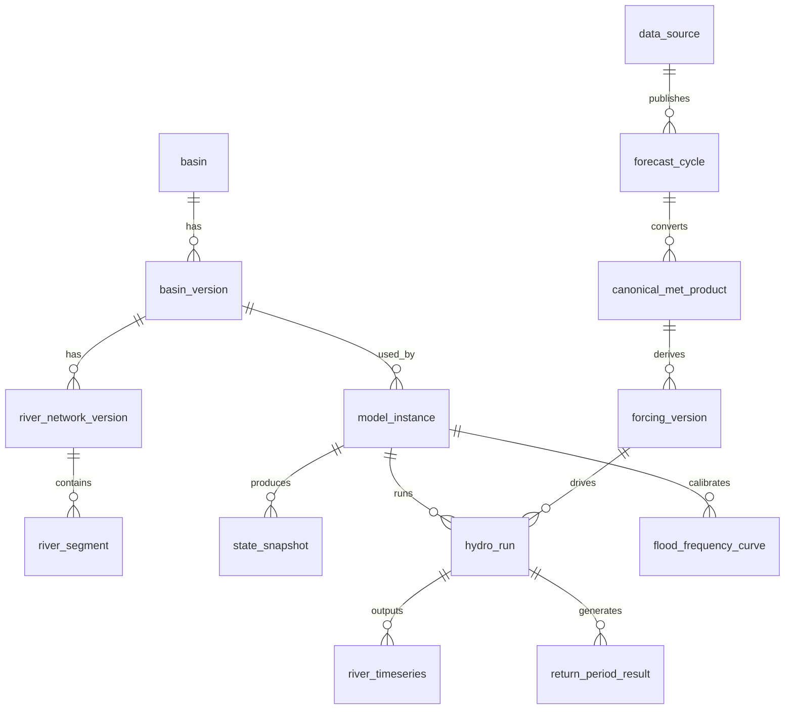

# 03. 数据库设计

版本：v0.1  
日期：2026-04-30

## 1. 数据库选型

```text
PostgreSQL + PostGIS：空间对象、元数据、模型版本、河网版本、频率曲线。
TimescaleDB：高频 forcing、河段时序、重现期时序。
Object Storage：原始资料、canonical 产品、SHUD 输入输出、日志、瓦片。
```

## 2. Schema 分区

```text
core       系统核心对象、流域、模型、版本
met        气象资料源、周期、canonical 产品、forcing
hydro      SHUD 运行、状态快照、河段结果
flood      频率曲线和重现期结果
map        瓦片发布、图层、样式
ops        作业、日志、质量控制、审计
```

## 3. 核心实体关系



## 4. 关键表草案

### 4.1 `core.basin`

```sql
CREATE TABLE core.basin (
  basin_id TEXT PRIMARY KEY,
  basin_name TEXT NOT NULL,
  basin_group TEXT,
  description TEXT,
  created_at TIMESTAMPTZ NOT NULL DEFAULT now()
);
```

### 4.2 `core.basin_version`

```sql
CREATE TABLE core.basin_version (
  basin_version_id TEXT PRIMARY KEY,
  basin_id TEXT NOT NULL REFERENCES core.basin(basin_id),
  version_label TEXT NOT NULL,
  geom geometry(MultiPolygon, 4490) NOT NULL,
  active_flag BOOLEAN NOT NULL DEFAULT false,
  valid_from TIMESTAMPTZ,
  valid_to TIMESTAMPTZ,
  source_uri TEXT,
  checksum TEXT,
  created_at TIMESTAMPTZ NOT NULL DEFAULT now()
);
CREATE INDEX basin_version_geom_gix ON core.basin_version USING gist (geom);
```

### 4.3 `core.model_instance`

```sql
CREATE TABLE core.model_instance (
  model_id TEXT PRIMARY KEY,
  basin_version_id TEXT NOT NULL REFERENCES core.basin_version(basin_version_id),
  river_network_version_id TEXT NOT NULL,
  mesh_version_id TEXT NOT NULL,
  calibration_version_id TEXT NOT NULL,
  shud_code_version TEXT NOT NULL,
  rshud_code_version TEXT,
  autoshud_code_version TEXT,
  container_image TEXT,
  model_package_uri TEXT NOT NULL,
  active_flag BOOLEAN NOT NULL DEFAULT false,
  resource_profile JSONB NOT NULL DEFAULT '{}',
  created_at TIMESTAMPTZ NOT NULL DEFAULT now()
);
```

### 4.4 `met.data_source`

```sql
CREATE TABLE met.data_source (
  source_id TEXT PRIMARY KEY,
  source_name TEXT NOT NULL,
  source_type TEXT NOT NULL,
  status TEXT NOT NULL,
  native_format TEXT,
  license_status TEXT,
  adapter_name TEXT NOT NULL,
  config_json JSONB NOT NULL DEFAULT '{}',
  created_at TIMESTAMPTZ NOT NULL DEFAULT now()
);
```

### 4.5 `met.forecast_cycle`

```sql
CREATE TABLE met.forecast_cycle (
  cycle_id TEXT PRIMARY KEY,
  source_id TEXT NOT NULL REFERENCES met.data_source(source_id),
  cycle_time TIMESTAMPTZ NOT NULL,
  issue_time TIMESTAMPTZ,
  status TEXT NOT NULL,
  manifest_uri TEXT,
  retry_count INT NOT NULL DEFAULT 0,
  error_code TEXT,
  error_message TEXT,
  created_at TIMESTAMPTZ NOT NULL DEFAULT now(),
  UNIQUE (source_id, cycle_time)
);
```

### 4.6 `hydro.hydro_run`

```sql
CREATE TABLE hydro.hydro_run (
  run_id TEXT PRIMARY KEY,
  run_type TEXT NOT NULL,
  scenario_id TEXT NOT NULL,
  model_id TEXT NOT NULL REFERENCES core.model_instance(model_id),
  basin_version_id TEXT NOT NULL,
  forcing_version_id TEXT,
  init_state_id TEXT,
  source_id TEXT,
  cycle_time TIMESTAMPTZ,
  start_time TIMESTAMPTZ NOT NULL,
  end_time TIMESTAMPTZ NOT NULL,
  status TEXT NOT NULL,
  slurm_job_id TEXT,
  run_manifest_uri TEXT NOT NULL,
  output_uri TEXT,
  log_uri TEXT,
  error_code TEXT,
  error_message TEXT,
  created_at TIMESTAMPTZ NOT NULL DEFAULT now(),
  updated_at TIMESTAMPTZ NOT NULL DEFAULT now()
);
```

### 4.7 `hydro.river_timeseries`

```sql
CREATE TABLE hydro.river_timeseries (
  run_id TEXT NOT NULL,
  basin_version_id TEXT NOT NULL,
  river_segment_id TEXT NOT NULL,
  valid_time TIMESTAMPTZ NOT NULL,
  lead_time_hours INT,
  variable TEXT NOT NULL,
  value DOUBLE PRECISION NOT NULL,
  unit TEXT NOT NULL,
  quality_flag TEXT NOT NULL DEFAULT 'ok',
  created_at TIMESTAMPTZ NOT NULL DEFAULT now(),
  PRIMARY KEY (run_id, river_segment_id, variable, valid_time)
);
SELECT create_hypertable('hydro.river_timeseries', 'valid_time', if_not_exists => TRUE);
CREATE INDEX river_ts_segment_time_idx ON hydro.river_timeseries (river_segment_id, variable, valid_time DESC);
```

### 4.8 `flood.flood_frequency_curve`

```sql
CREATE TABLE flood.flood_frequency_curve (
  curve_id TEXT PRIMARY KEY,
  model_id TEXT NOT NULL,
  basin_version_id TEXT NOT NULL,
  river_segment_id TEXT NOT NULL,
  duration TEXT NOT NULL,
  method TEXT NOT NULL,
  sample_period_start DATE NOT NULL,
  sample_period_end DATE NOT NULL,
  sample_size INT NOT NULL,
  parameters_json JSONB NOT NULL,
  q2 DOUBLE PRECISION,
  q5 DOUBLE PRECISION,
  q10 DOUBLE PRECISION,
  q20 DOUBLE PRECISION,
  q50 DOUBLE PRECISION,
  q100 DOUBLE PRECISION,
  unit TEXT NOT NULL DEFAULT 'm3/s',
  quality_flag TEXT NOT NULL,
  created_at TIMESTAMPTZ NOT NULL DEFAULT now(),
  UNIQUE (model_id, river_segment_id, duration, method, sample_period_start, sample_period_end)
);
```

### 4.9 `core.river_network_version`

```sql
CREATE TABLE core.river_network_version (
  river_network_version_id TEXT PRIMARY KEY,
  basin_version_id TEXT NOT NULL REFERENCES core.basin_version(basin_version_id),
  version_label TEXT NOT NULL,
  segment_count INT NOT NULL,
  source_uri TEXT,
  checksum TEXT,
  created_at TIMESTAMPTZ NOT NULL DEFAULT now()
);
```

### 4.10 `core.river_segment`

```sql
CREATE TABLE core.river_segment (
  river_segment_id TEXT NOT NULL,
  river_network_version_id TEXT NOT NULL REFERENCES core.river_network_version(river_network_version_id),
  segment_order INT,
  downstream_segment_id TEXT,
  length_m DOUBLE PRECISION,
  geom geometry(LineString, 4490),
  properties_json JSONB NOT NULL DEFAULT '{}',
  created_at TIMESTAMPTZ NOT NULL DEFAULT now(),
  PRIMARY KEY (river_segment_id, river_network_version_id)
);
CREATE INDEX river_segment_geom_gix ON core.river_segment USING gist (geom);
```

### 4.11 `hydro.state_snapshot`

```sql
CREATE TABLE hydro.state_snapshot (
  state_id TEXT PRIMARY KEY,
  model_id TEXT NOT NULL REFERENCES core.model_instance(model_id),
  run_id TEXT NOT NULL REFERENCES hydro.hydro_run(run_id),
  valid_time TIMESTAMPTZ NOT NULL,
  state_uri TEXT NOT NULL,
  checksum TEXT NOT NULL,
  usable_flag BOOLEAN NOT NULL DEFAULT false,
  created_at TIMESTAMPTZ NOT NULL DEFAULT now(),
  UNIQUE (model_id, valid_time)
);
```

### 4.12 `met.forcing_version`

```sql
CREATE TABLE met.forcing_version (
  forcing_version_id TEXT PRIMARY KEY,
  model_id TEXT NOT NULL REFERENCES core.model_instance(model_id),
  source_id TEXT NOT NULL REFERENCES met.data_source(source_id),
  cycle_time TIMESTAMPTZ,
  start_time TIMESTAMPTZ NOT NULL,
  end_time TIMESTAMPTZ NOT NULL,
  station_count INT NOT NULL,
  forcing_package_uri TEXT NOT NULL,
  checksum TEXT,
  lineage_json JSONB NOT NULL DEFAULT '{}',
  created_at TIMESTAMPTZ NOT NULL DEFAULT now()
);
```

### 4.13 `met.canonical_met_product`

```sql
CREATE TABLE met.canonical_met_product (
  canonical_product_id TEXT PRIMARY KEY,
  source_id TEXT NOT NULL REFERENCES met.data_source(source_id),
  source_version TEXT,
  cycle_time TIMESTAMPTZ NOT NULL,
  valid_time TIMESTAMPTZ NOT NULL,
  lead_time_hours INT,
  variable TEXT NOT NULL,
  unit TEXT NOT NULL,
  grid_id TEXT NOT NULL,
  native_time_resolution TEXT,
  native_spatial_resolution TEXT,
  object_uri TEXT NOT NULL,
  checksum TEXT NOT NULL,
  quality_flag TEXT NOT NULL DEFAULT 'ok',
  lineage_json JSONB NOT NULL DEFAULT '{}',
  created_at TIMESTAMPTZ NOT NULL DEFAULT now()
);
CREATE INDEX canonical_met_source_cycle_idx ON met.canonical_met_product (source_id, cycle_time, variable);
```

### 4.14 `met.best_available_selection`

```sql
CREATE TABLE met.best_available_selection (
  selection_id BIGSERIAL PRIMARY KEY,
  valid_time TIMESTAMPTZ NOT NULL,
  variable TEXT NOT NULL,
  selected_source TEXT NOT NULL,
  source_cycle_time TIMESTAMPTZ NOT NULL,
  fallback_order TEXT[] NOT NULL,
  quality_flag TEXT NOT NULL DEFAULT 'best_available_realtime',
  created_at TIMESTAMPTZ NOT NULL DEFAULT now(),
  UNIQUE (valid_time, variable)
);
SELECT create_hypertable('met.best_available_selection', 'valid_time', if_not_exists => TRUE);
```

### 4.15 `map.tile_layer`

```sql
CREATE TABLE map.tile_layer (
  layer_id TEXT PRIMARY KEY,
  layer_type TEXT NOT NULL,
  source_run_id TEXT,
  source_product_id TEXT,
  variable TEXT,
  valid_time TIMESTAMPTZ,
  tile_format TEXT NOT NULL,
  tile_uri_template TEXT NOT NULL,
  min_zoom INT NOT NULL DEFAULT 0,
  max_zoom INT NOT NULL DEFAULT 14,
  style_json JSONB,
  published_flag BOOLEAN NOT NULL DEFAULT false,
  publish_time TIMESTAMPTZ,
  created_at TIMESTAMPTZ NOT NULL DEFAULT now()
);
```

### 4.16 `map.tile_cache`

```sql
CREATE TABLE map.tile_cache (
  layer_id TEXT NOT NULL REFERENCES map.tile_layer(layer_id),
  z INT NOT NULL,
  x INT NOT NULL,
  y INT NOT NULL,
  tile_data BYTEA,
  tile_uri TEXT,
  etag TEXT,
  created_at TIMESTAMPTZ NOT NULL DEFAULT now(),
  PRIMARY KEY (layer_id, z, x, y)
);
```

## 5. 查询模式

### 5.1 点击河段曲线

```sql
SELECT valid_time, scenario_id, variable, value, unit
FROM hydro.river_timeseries rt
JOIN hydro.hydro_run hr ON rt.run_id = hr.run_id
WHERE rt.river_segment_id = :segment_id
  AND rt.variable = 'q_down'
  AND hr.run_id IN (:analysis_run_id, :gfs_run_id, :ifs_run_id)
ORDER BY valid_time;
```

### 5.2 获取河段重现期瓦片属性

```sql
SELECT river_segment_id, max(return_period) AS max_t
FROM flood.return_period_result
WHERE run_id = :run_id
  AND valid_time BETWEEN :start_time AND :end_time
GROUP BY river_segment_id;
```

## 6. 版本切换规则

- 新 model_instance 上线后，必须先 `active_flag=false`。
- 完成 smoke test、历史样本、频率曲线后，才可设为 active。
- 同一个 basin_version 可有多个 model_instance，但同一业务产品线只能有一个 active model。
- 旧模型不可删除，只能 deprecated。
