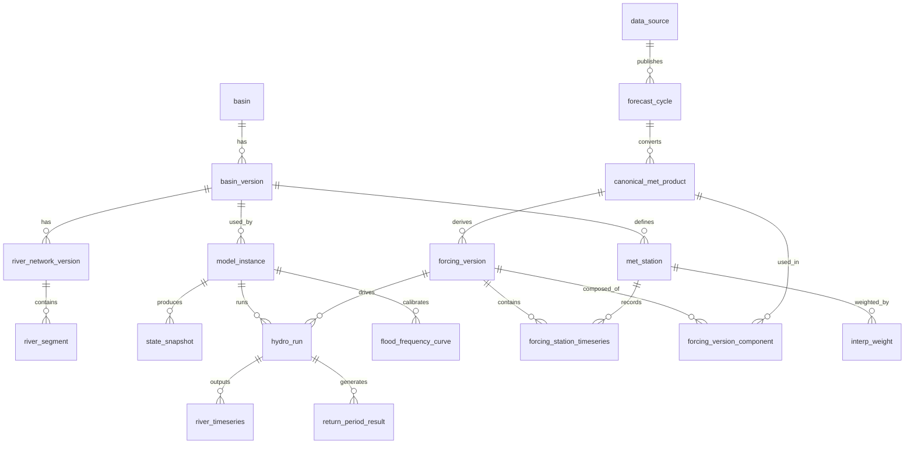

# 03. 数据库设计

版本：v0.2  
日期：2026-05-06

## 1. 数据库选型

```text
PostgreSQL + PostGIS：空间对象、元数据、模型版本、河网版本、频率曲线。
TimescaleDB：高频 forcing、河段时序、重现期时序。
Object Storage：原始资料、canonical 产品、SHUD 输入输出、日志、瓦片。
```

## 2. Schema 分区

```text
core       系统核心对象、流域、模型、版本
met        气象资料源、周期、canonical 产品、forcing
hydro      SHUD 运行、状态快照、河段结果
flood      频率曲线和重现期结果
map        瓦片发布、图层、样式
ops        作业、日志、质量控制、审计
```

## 3. 核心实体关系



## 4. 状态枚举类型

> 关键状态字段必须使用 ENUM 约束，避免业务运行后出现 `success`/`succeeded`/`done`/`complete` 等混用。

```sql
CREATE TYPE hydro.run_type AS ENUM (
  'analysis',
  'forecast',
  'hindcast'
);

CREATE TYPE hydro.run_status AS ENUM (
  'created',
  'staged',
  'submitted',
  'running',
  'succeeded',
  'parsed',
  'frequency_done',
  'published',
  'failed',
  'cancelled',
  'superseded'
);

CREATE TYPE met.source_status AS ENUM (
  'enabled',
  'restricted',
  'planned',
  'mock',
  'deprecated'
);

CREATE TYPE met.cycle_status AS ENUM (
  'discovered',
  'downloading',
  'raw_complete',
  'canonical_ready',
  'forcing_ready_partial',
  'forcing_ready',
  'forecast_running',
  'parsed_partial',
  'complete',
  'published',
  'failed_download',
  'failed_convert',
  'failed_forcing',
  'failed_run',
  'failed_parse',
  'failed_publish'
);
```

## 5. 关键表定义

> 建表顺序按外键依赖排列。表编号按 `{schema}.{逻辑顺序}` 连续编排。

### 5.1 `core.basin`

```sql
CREATE TABLE core.basin (
  basin_id TEXT PRIMARY KEY,
  basin_name TEXT NOT NULL,
  basin_group TEXT,
  description TEXT,
  created_at TIMESTAMPTZ NOT NULL DEFAULT now()
);
```

### 5.2 `core.basin_version`

```sql
CREATE TABLE core.basin_version (
  basin_version_id TEXT PRIMARY KEY,
  basin_id TEXT NOT NULL REFERENCES core.basin(basin_id),
  version_label TEXT NOT NULL,
  geom geometry(MultiPolygon, 4490) NOT NULL,
  active_flag BOOLEAN NOT NULL DEFAULT false,
  valid_from TIMESTAMPTZ,
  valid_to TIMESTAMPTZ,
  source_uri TEXT,
  checksum TEXT,
  created_at TIMESTAMPTZ NOT NULL DEFAULT now()
);
CREATE INDEX basin_version_geom_gix ON core.basin_version USING gist (geom);
```

### 5.3 `core.river_network_version`

```sql
CREATE TABLE core.river_network_version (
  river_network_version_id TEXT PRIMARY KEY,
  basin_version_id TEXT NOT NULL REFERENCES core.basin_version(basin_version_id),
  version_label TEXT NOT NULL,
  segment_count INT NOT NULL,
  source_uri TEXT,
  checksum TEXT,
  created_at TIMESTAMPTZ NOT NULL DEFAULT now()
);
```

### 5.4 `core.river_segment`

```sql
CREATE TABLE core.river_segment (
  river_segment_id TEXT NOT NULL,
  river_network_version_id TEXT NOT NULL REFERENCES core.river_network_version(river_network_version_id),
  segment_order INT,
  downstream_segment_id TEXT,
  length_m DOUBLE PRECISION,
  geom geometry(MultiLineString, 4490),
  properties_json JSONB NOT NULL DEFAULT '{}',
  created_at TIMESTAMPTZ NOT NULL DEFAULT now(),
  PRIMARY KEY (river_segment_id, river_network_version_id)
);
CREATE INDEX river_segment_geom_gix ON core.river_segment USING gist (geom);
```

> `geom` 列在 migration 000037 升为 `MultiLineString(4490)`；PR-2 (issue #561) 之后所有写入的 reach 行 holds exactly one part（来源于 `gis/river.shp` 的单 part flow-ordered polyline），wrapper 类型保留是为了将来某 basin 的源数据若真正需要 multi-part reach 时不必再做 schema 变更。

### 5.5 `core.model_instance`

```sql
CREATE TABLE core.model_instance (
  model_id TEXT PRIMARY KEY,
  basin_version_id TEXT NOT NULL REFERENCES core.basin_version(basin_version_id),
  river_network_version_id TEXT NOT NULL REFERENCES core.river_network_version(river_network_version_id),
  mesh_version_id TEXT NOT NULL,
  calibration_version_id TEXT NOT NULL,
  shud_code_version TEXT NOT NULL,
  rshud_code_version TEXT,
  autoshud_code_version TEXT,
  container_image TEXT,
  model_package_uri TEXT NOT NULL,
  active_flag BOOLEAN NOT NULL DEFAULT false,
  resource_profile JSONB NOT NULL DEFAULT '{}',
  created_at TIMESTAMPTZ NOT NULL DEFAULT now()
);
```

### 5.6 `met.data_source`

```sql
CREATE TABLE met.data_source (
  source_id TEXT PRIMARY KEY,
  source_name TEXT NOT NULL,
  source_type TEXT NOT NULL,
  status met.source_status NOT NULL,
  native_format TEXT,
  license_status TEXT,
  adapter_name TEXT NOT NULL,
  config_json JSONB NOT NULL DEFAULT '{}',
  created_at TIMESTAMPTZ NOT NULL DEFAULT now()
);
```

### 5.7 `met.forecast_cycle`

```sql
CREATE TABLE met.forecast_cycle (
  cycle_id TEXT PRIMARY KEY,
  source_id TEXT NOT NULL REFERENCES met.data_source(source_id),
  cycle_time TIMESTAMPTZ NOT NULL,
  issue_time TIMESTAMPTZ,
  status met.cycle_status NOT NULL,
  manifest_uri TEXT,
  retry_count INT NOT NULL DEFAULT 0,
  error_code TEXT,
  error_message TEXT,
  created_at TIMESTAMPTZ NOT NULL DEFAULT now(),
  UNIQUE (source_id, cycle_time)
);
```

### 5.8 `met.canonical_met_product`

```sql
CREATE TABLE met.canonical_met_product (
  canonical_product_id TEXT PRIMARY KEY,
  source_id TEXT NOT NULL REFERENCES met.data_source(source_id),
  source_version TEXT,
  cycle_time TIMESTAMPTZ NOT NULL,
  valid_time TIMESTAMPTZ NOT NULL,
  lead_time_hours INT,
  variable TEXT NOT NULL,
  unit TEXT NOT NULL,
  grid_id TEXT NOT NULL,
  grid_definition_uri TEXT,
  native_time_resolution TEXT,
  native_spatial_resolution TEXT,
  object_uri TEXT NOT NULL,
  checksum TEXT NOT NULL,
  quality_flag TEXT NOT NULL DEFAULT 'ok',
  lineage_json JSONB NOT NULL DEFAULT '{}',
  created_at TIMESTAMPTZ NOT NULL DEFAULT now()
);
CREATE INDEX canonical_met_source_cycle_idx ON met.canonical_met_product (source_id, cycle_time, variable);
```

### 5.9 `met.met_station`

> 气象代站是流域地理实体，与 `basin_version` 绑定，不与单个 `model_instance` 耦合。多个模型版本可共享同一组代站。模型-特定的格点权重通过 `met.interp_weight` 关联。

```sql
CREATE TABLE met.met_station (
  station_id TEXT PRIMARY KEY,
  basin_version_id TEXT NOT NULL REFERENCES core.basin_version(basin_version_id),
  station_name TEXT,
  geom geometry(Point, 4490) NOT NULL,
  elevation_m DOUBLE PRECISION,
  station_role TEXT NOT NULL DEFAULT 'forcing_proxy',
  active_flag BOOLEAN NOT NULL DEFAULT true,
  properties_json JSONB NOT NULL DEFAULT '{}',
  created_at TIMESTAMPTZ NOT NULL DEFAULT now()
);
CREATE INDEX met_station_geom_gix ON met.met_station USING gist (geom);
CREATE INDEX met_station_basin_idx ON met.met_station (basin_version_id);
```

### 5.10 `met.interp_weight`

```sql
CREATE TABLE met.interp_weight (
  weight_id BIGSERIAL PRIMARY KEY,
  source_id TEXT NOT NULL REFERENCES met.data_source(source_id),
  grid_id TEXT NOT NULL,
  model_id TEXT NOT NULL REFERENCES core.model_instance(model_id),
  station_id TEXT NOT NULL REFERENCES met.met_station(station_id),
  variable TEXT NOT NULL,
  grid_cell_id TEXT NOT NULL,
  weight DOUBLE PRECISION NOT NULL,
  method TEXT NOT NULL,
  created_at TIMESTAMPTZ NOT NULL DEFAULT now(),
  UNIQUE (source_id, grid_id, model_id, station_id, variable, grid_cell_id)
);
```

### 5.11 `met.forcing_version`

```sql
CREATE TABLE met.forcing_version (
  forcing_version_id TEXT PRIMARY KEY,
  model_id TEXT NOT NULL REFERENCES core.model_instance(model_id),
  source_id TEXT NOT NULL REFERENCES met.data_source(source_id),
  cycle_time TIMESTAMPTZ,
  start_time TIMESTAMPTZ NOT NULL,
  end_time TIMESTAMPTZ NOT NULL,
  station_count INT NOT NULL,
  forcing_package_uri TEXT NOT NULL,
  checksum TEXT,
  lineage_json JSONB NOT NULL DEFAULT '{}',
  created_at TIMESTAMPTZ NOT NULL DEFAULT now()
);
```

### 5.11b `met.forcing_version_component`

> 显式记录每个 forcing_version 由哪些 canonical_met_product 组成，用于血缘查询和审计，避免依赖 JSON 解析。

```sql
CREATE TABLE met.forcing_version_component (
  forcing_version_id TEXT NOT NULL REFERENCES met.forcing_version(forcing_version_id),
  canonical_product_id TEXT NOT NULL REFERENCES met.canonical_met_product(canonical_product_id),
  variable TEXT NOT NULL,
  valid_time_start TIMESTAMPTZ,
  valid_time_end TIMESTAMPTZ,
  role TEXT NOT NULL DEFAULT 'forcing_input',
  created_at TIMESTAMPTZ NOT NULL DEFAULT now(),
  PRIMARY KEY (forcing_version_id, canonical_product_id, variable)
);
```

### 5.12 `met.forcing_station_timeseries`

> 气象代站 forcing 时序是前端代站曲线、forcing 追溯和 SHUD 输入审计的核心表。

```sql
CREATE TABLE met.forcing_station_timeseries (
  forcing_version_id TEXT NOT NULL REFERENCES met.forcing_version(forcing_version_id),
  basin_version_id TEXT NOT NULL,
  station_id TEXT NOT NULL REFERENCES met.met_station(station_id),
  valid_time TIMESTAMPTZ NOT NULL,
  source_id TEXT NOT NULL,
  variable TEXT NOT NULL,
  value DOUBLE PRECISION NOT NULL,
  unit TEXT NOT NULL,
  native_resolution TEXT,
  quality_flag TEXT NOT NULL DEFAULT 'ok',
  PRIMARY KEY (forcing_version_id, station_id, variable, valid_time)
);
SELECT create_hypertable('met.forcing_station_timeseries', 'valid_time', if_not_exists => TRUE);
```

### 5.13 `met.best_available_selection`

> v1 规则采用全域选择：每个时刻每个变量全系统统一选择一个 source。如果后续需要空间分区混合（如 CLDAS 仅覆盖中国区域），可升级为 `UNIQUE (valid_time, variable, domain_id)` 或 grid-cell 级 lineage。当前设计满足 MVP 需求。

```sql
CREATE TABLE met.best_available_selection (
  selection_id BIGSERIAL PRIMARY KEY,
  valid_time TIMESTAMPTZ NOT NULL,
  variable TEXT NOT NULL,
  selected_source TEXT NOT NULL,
  source_cycle_time TIMESTAMPTZ NOT NULL,
  fallback_order TEXT[] NOT NULL,
  quality_flag TEXT NOT NULL DEFAULT 'best_available_realtime',
  created_at TIMESTAMPTZ NOT NULL DEFAULT now(),
  UNIQUE (valid_time, variable)
);
SELECT create_hypertable('met.best_available_selection', 'valid_time', if_not_exists => TRUE);
```

### 5.14 `hydro.hydro_run`

```sql
CREATE TABLE hydro.hydro_run (
  run_id TEXT PRIMARY KEY,
  run_type hydro.run_type NOT NULL,
  scenario_id TEXT NOT NULL,
  model_id TEXT NOT NULL REFERENCES core.model_instance(model_id),
  basin_version_id TEXT NOT NULL REFERENCES core.basin_version(basin_version_id),
  forcing_version_id TEXT REFERENCES met.forcing_version(forcing_version_id),
  init_state_id TEXT,
  source_id TEXT REFERENCES met.data_source(source_id),
  cycle_time TIMESTAMPTZ,
  start_time TIMESTAMPTZ NOT NULL,
  end_time TIMESTAMPTZ NOT NULL,
  status hydro.run_status NOT NULL,
  slurm_job_id TEXT,
  run_manifest_uri TEXT NOT NULL,
  output_uri TEXT,
  log_uri TEXT,
  error_code TEXT,
  error_message TEXT,
  created_at TIMESTAMPTZ NOT NULL DEFAULT now(),
  updated_at TIMESTAMPTZ NOT NULL DEFAULT now()
);
```

> `init_state_id` 暂保留为 TEXT 不加外键，因为 `state_snapshot` 与 `hydro_run` 存在循环依赖（run 产生 state，state 又作为下一 run 的 init）。可通过后置 `ALTER TABLE` 或应用层约束保证引用完整性。

### 5.15 `hydro.state_snapshot`

```sql
CREATE TABLE hydro.state_snapshot (
  state_id TEXT PRIMARY KEY,
  model_id TEXT NOT NULL REFERENCES core.model_instance(model_id),
  run_id TEXT NOT NULL REFERENCES hydro.hydro_run(run_id),
  valid_time TIMESTAMPTZ NOT NULL,
  state_uri TEXT NOT NULL,
  checksum TEXT NOT NULL,
  usable_flag BOOLEAN NOT NULL DEFAULT false,
  created_at TIMESTAMPTZ NOT NULL DEFAULT now(),
  UNIQUE (model_id, valid_time)
);
```

### 5.16 `hydro.river_timeseries`

> `river_segment` 的主键是 `(river_segment_id, river_network_version_id)` 复合键，因此 `river_timeseries` 必须同时保存 `river_network_version_id`，否则跨河网版本升级后会产生歧义。主键也纳入 `river_network_version_id` 以保持自洽。

```sql
CREATE TABLE hydro.river_timeseries (
  run_id TEXT NOT NULL,
  basin_version_id TEXT NOT NULL,
  river_network_version_id TEXT NOT NULL,
  river_segment_id TEXT NOT NULL,
  valid_time TIMESTAMPTZ NOT NULL,
  lead_time_hours INT,
  variable TEXT NOT NULL,
  value DOUBLE PRECISION NOT NULL,
  unit TEXT NOT NULL,
  quality_flag TEXT NOT NULL DEFAULT 'ok',
  created_at TIMESTAMPTZ NOT NULL DEFAULT now(),
  PRIMARY KEY (run_id, river_network_version_id, river_segment_id, variable, valid_time),
  FOREIGN KEY (river_segment_id, river_network_version_id)
    REFERENCES core.river_segment(river_segment_id, river_network_version_id)
);
SELECT create_hypertable('hydro.river_timeseries', 'valid_time', if_not_exists => TRUE);
CREATE INDEX river_ts_segment_time_idx ON hydro.river_timeseries (river_segment_id, variable, valid_time DESC);
```

### 5.17 `flood.flood_frequency_curve`

```sql
CREATE TABLE flood.flood_frequency_curve (
  curve_id TEXT PRIMARY KEY,
  model_id TEXT NOT NULL REFERENCES core.model_instance(model_id),
  river_network_version_id TEXT NOT NULL,
  basin_version_id TEXT NOT NULL,
  river_segment_id TEXT NOT NULL,
  duration TEXT NOT NULL,
  method TEXT NOT NULL,
  sample_period_start DATE NOT NULL,
  sample_period_end DATE NOT NULL,
  sample_size INT NOT NULL,
  parameters_json JSONB NOT NULL,
  q2 DOUBLE PRECISION,
  q5 DOUBLE PRECISION,
  q10 DOUBLE PRECISION,
  q20 DOUBLE PRECISION,
  q50 DOUBLE PRECISION,
  q100 DOUBLE PRECISION,
  unit TEXT NOT NULL DEFAULT 'm3/s',
  quality_flag TEXT NOT NULL,
  created_at TIMESTAMPTZ NOT NULL DEFAULT now(),
  UNIQUE (model_id, river_network_version_id, river_segment_id, duration, method, sample_period_start, sample_period_end)
);
```

### 5.18 `flood.return_period_result`

> 前端洪水预警图层和预警聚合 API 的核心产品表。除原始 run 关联外，补充版本和来源字段以支持跨版本追溯和瓦片发布。

```sql
CREATE TABLE flood.return_period_result (
  run_id TEXT NOT NULL REFERENCES hydro.hydro_run(run_id),
  scenario_id TEXT NOT NULL,
  basin_version_id TEXT NOT NULL,
  river_network_version_id TEXT NOT NULL,
  model_id TEXT NOT NULL,
  river_segment_id TEXT NOT NULL,
  valid_time TIMESTAMPTZ NOT NULL,
  duration TEXT NOT NULL,
  q_value DOUBLE PRECISION NOT NULL,
  q_unit TEXT NOT NULL DEFAULT 'm3/s',
  return_period DOUBLE PRECISION,
  warning_level TEXT,
  source_id TEXT,
  cycle_time TIMESTAMPTZ,
  max_over_window BOOLEAN DEFAULT false,
  quality_flag TEXT NOT NULL DEFAULT 'ok',
  created_at TIMESTAMPTZ NOT NULL DEFAULT now(),
  PRIMARY KEY (run_id, river_segment_id, duration, valid_time)
);
SELECT create_hypertable('flood.return_period_result', 'valid_time', if_not_exists => TRUE);
```

### 5.19 `map.tile_layer`

```sql
CREATE TABLE map.tile_layer (
  layer_id TEXT PRIMARY KEY,
  layer_type TEXT NOT NULL,
  source_run_id TEXT,
  source_product_id TEXT,
  variable TEXT,
  valid_time TIMESTAMPTZ,
  tile_format TEXT NOT NULL,
  tile_uri_template TEXT NOT NULL,
  min_zoom INT NOT NULL DEFAULT 0,
  max_zoom INT NOT NULL DEFAULT 14,
  style_json JSONB,
  published_flag BOOLEAN NOT NULL DEFAULT false,
  publish_time TIMESTAMPTZ,
  created_at TIMESTAMPTZ NOT NULL DEFAULT now()
);
```

### 5.20 `map.tile_cache`

```sql
CREATE TABLE map.tile_cache (
  layer_id TEXT NOT NULL REFERENCES map.tile_layer(layer_id),
  z INT NOT NULL,
  x INT NOT NULL,
  y INT NOT NULL,
  tile_data BYTEA,
  tile_uri TEXT,
  etag TEXT,
  created_at TIMESTAMPTZ NOT NULL DEFAULT now(),
  PRIMARY KEY (layer_id, z, x, y)
);
```

## 6. 查询模式

### 6.1 点击河段曲线

```sql
SELECT valid_time, scenario_id, variable, value, unit
FROM hydro.river_timeseries rt
JOIN hydro.hydro_run hr ON rt.run_id = hr.run_id
WHERE rt.river_segment_id = :segment_id
  AND rt.variable = 'q_down'
  AND hr.run_id IN (:analysis_run_id, :gfs_run_id, :ifs_run_id)
ORDER BY valid_time;
```

### 6.2 获取河段重现期瓦片属性

```sql
SELECT river_segment_id, max(return_period) AS max_t
FROM flood.return_period_result
WHERE run_id = :run_id
  AND valid_time BETWEEN :start_time AND :end_time
GROUP BY river_segment_id;
```

## 7. 版本切换规则

- 新 model_instance 上线后，必须先 `active_flag=false`。
- 完成 smoke test、历史样本、频率曲线后，才可设为 active。
- 同一个 basin_version 可有多个 model_instance，但同一业务产品线只能有一个 active model。
- 旧模型不可删除，只能 deprecated。

## 8. 本文档与附录 C 的职责分工

```text
03_database_design.md（本文档）：
  实体关系、设计原则、完整表定义、枚举类型、查询模式、版本规则。
  作为数据库设计的权威来源。

C_database_schema_draft.md（附录 C）：
  接近 migration 的 SQL 草案，可包含索引优化、分区策略等实施细节。
  当两处不一致时，以本文档为准。
```
