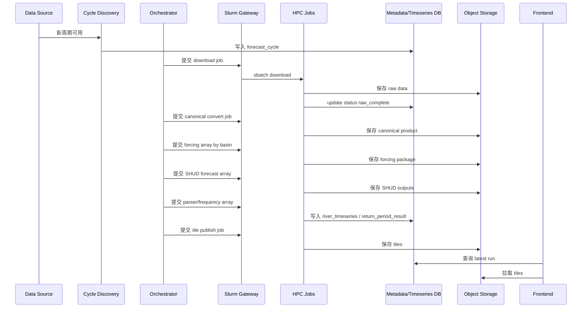

# 01. 系统架构与端到端流程

版本：v0.1  
日期：2026-04-30

## 1. 架构分层

全国水文模拟系统分为四个平面。

```text
1. 业务控制平面：资料源、任务状态机、元数据、API、前端发布。
2. HPC 计算平面：资料下载、forcing 生产、SHUD 运行、结果解析、频率计算。
3. 存储平面：PostGIS、TimescaleDB、对象存储、瓦片存储。
4. 前端展示平面：全国地图、时间轴、图层控制、曲线展示。
```

这种分层的核心价值是让“业务状态”和“重计算作业”解耦：控制平面可以轻量、高可用；HPC 平面可以重计算、可重试、可水平扩展。

## 2. 核心组件

| 组件 | 责任 |
|---|---|
| Data Source Registry | 登记资料源、权限状态、变量映射、更新规则。 |
| Cycle Discovery Service | 发现 GFS/IFS/ERA5/CLDAS 等资料周期。 |
| Ingestion Worker | 下载、校验、归档原始资料。 |
| Canonical Converter | 转换为统一变量、单位、网格、时间轴。 |
| Forcing Producer | 生成 SHUD 可读气象代站 forcing。 |
| Model Registry | 管理流域、mesh、河网、率定、SHUD 版本。 |
| State Manager | 管理 analysis run 的 `.cfg.ic` 状态快照。 |
| Slurm Gateway | 提交、查询、取消 Slurm 作业。 |
| SHUD Runtime Adapter | 准备 run workspace 并执行 SHUD。 |
| Output Parser | 解析 `.rivqdown`、`.rivystage` 等输出。 |
| Flood Frequency Engine | 计算频率曲线与预报期重现期。 |
| API Service | 对前端和外部系统提供查询接口。 |
| Tile Publisher | 发布河网矢量瓦片和气象栅格瓦片。 |
| Web Frontend | 地图、曲线、scenario、时间轴交互。 |

## 3. Forecast 流程



## 4. Analysis 流程

```text
1. 发现可用真实场/再分析 forcing。
2. 对每个流域模型生成 forcing package。
3. 选择上一期 StateSnapshot。
4. 运行 SHUD analysis。
5. 解析水文状态和河段结果。
6. 生成新的 StateSnapshot。
7. 标记该状态可被 forecast run 使用。
```

关键要求：如果 ERA5 存在延迟，最近时段可以用 CLDAS、GDAS、GFS analysis 或 best_available 产品补齐，但必须保留来源标识。

## 5. 状态机

### 5.1 forecast_cycle 状态

```text
discovered
  → downloading
  → raw_complete
  → canonical_ready
  → forcing_ready_partial
  → forcing_ready
  → forecast_running
  → parsed_partial
  → complete
  → published
```

失败分支：`failed_download`、`failed_convert`、`failed_forcing`、`failed_run`、`failed_parse`、`failed_publish`。

### 5.2 hydro_run 状态

```text
created → staged → submitted → running → succeeded → parsed → frequency_done → published
```

异常状态：`failed`、`cancelled`、`superseded`。

## 6. Manifest 驱动

所有 HPC 作业都通过 manifest 文件驱动，避免作业依赖数据库连接和 Web 服务。

```json
{
  "run_id": "fcst_gfs_2026043000_yangtze_v12",
  "run_type": "forecast",
  "scenario_id": "forecast_gfs_deterministic",
  "model_id": "yangtze_shud_v12",
  "basin_version_id": "yangtze_v2026_01",
  "cycle_time": "2026-04-30T00:00:00Z",
  "start_time": "2026-04-30T00:00:00Z",
  "end_time": "2026-05-07T00:00:00Z",
  "init_state_uri": "s3://nhms/states/yangtze_shud_v12/2026043000.ic",
  "forcing_uri": "s3://nhms/forcing/gfs/2026043000/yangtze_v2026_01/",
  "output_uri": "s3://nhms/runs/fcst_gfs_2026043000_yangtze_v12/output/",
  "threads": 32
}
```

## 7. 文件流

```text
raw/{source}/{cycle_time}/
canonical/{source}/{cycle_time}/{variable}/
forcing/{source}/{cycle_time}/{basin_version_id}/{model_id}/
models/{model_id}/
states/{model_id}/{valid_time}/
runs/{run_id}/input/
runs/{run_id}/output/
runs/{run_id}/logs/
tiles/met/{product_id}/
tiles/hydro/{run_id}/
```

## 8. 可靠性原则

1. 每一步必须可重跑，不依赖临时内存状态。
2. 每个输出对象必须带 checksum 或 etag。
3. Slurm 作业成功不等于产品成功，必须经过结果完整性检查。
4. 不覆盖已有产品；新版本通过 version/status 切换为 active。
5. 前端只读取 `published` 状态的产品。
6. 任何派生产品必须保留 source lineage。
